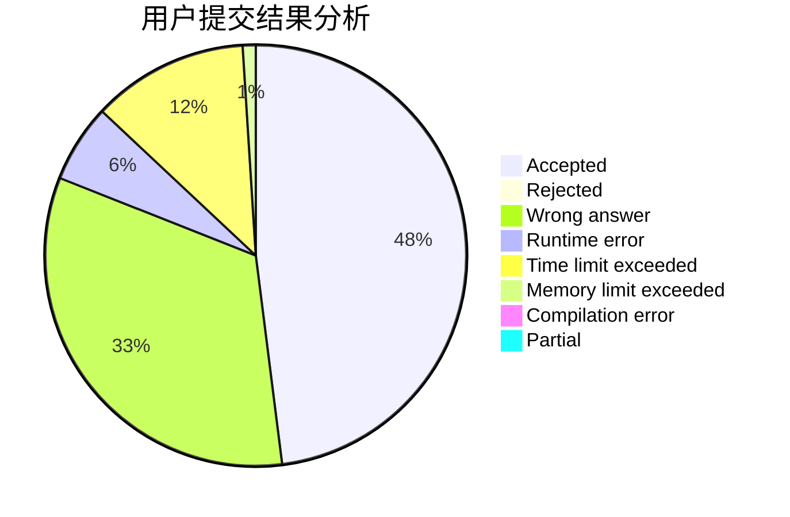
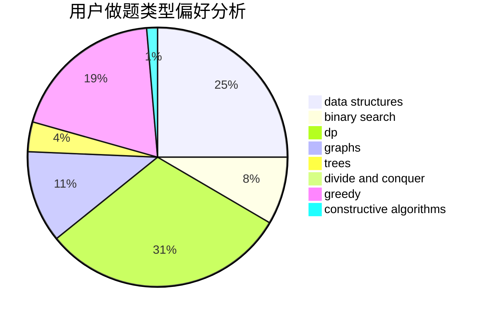
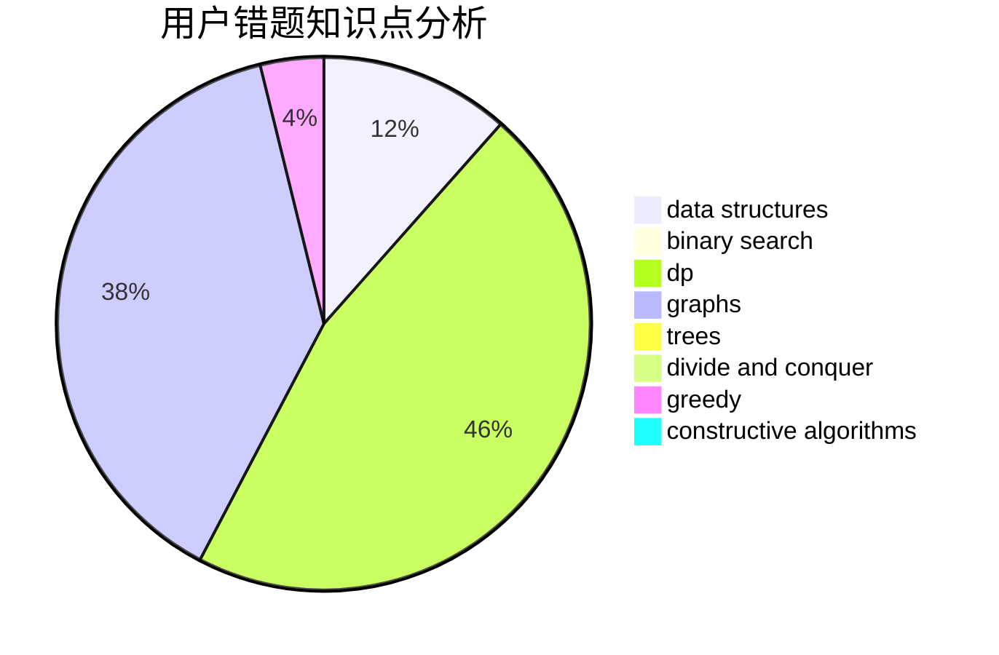

# ChenTingyang

<!-- tabs:start -->

#### **用户提交结果分析**

#### **用户做题类型偏好分析**

#### **用户错题知识点分析**

<!-- tabs:end -->
# 推荐题目
[699A](https://codeforces.com/contest/699/problem/A)		implementation		  
[456B](https://codeforces.com/contest/456/problem/B)		math,
                        number theory		  
[699C](https://codeforces.com/contest/699/problem/C)		dsu,graphs,sortings,trees		  
[590A](https://codeforces.com/contest/590/problem/A)		implementation		  
[699D](https://codeforces.com/contest/699/problem/D)		dsu,graphs,sortings,trees		  
[12622](https://codeforces.com/contest/1262/problem/2)		dsu,graphs,sortings,trees		  
[652F](https://codeforces.com/contest/652/problem/F)		constructive algorithms,
                        math		  
[699B](https://codeforces.com/contest/699/problem/B)		implementation		  
[698D](https://codeforces.com/contest/698/problem/D)		brute force,
                        geometry,
                        math		  
[457E](https://codeforces.com/contest/457/problem/E)		constructive algorithms,
                        flows,
                        math		  
