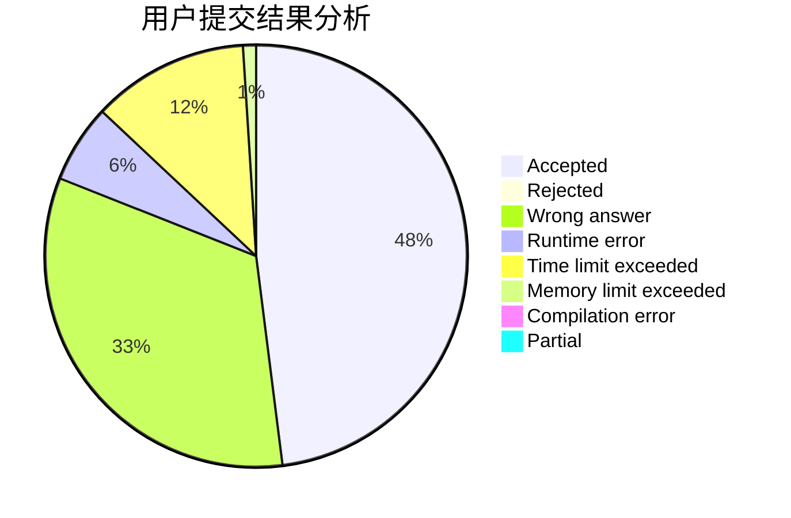
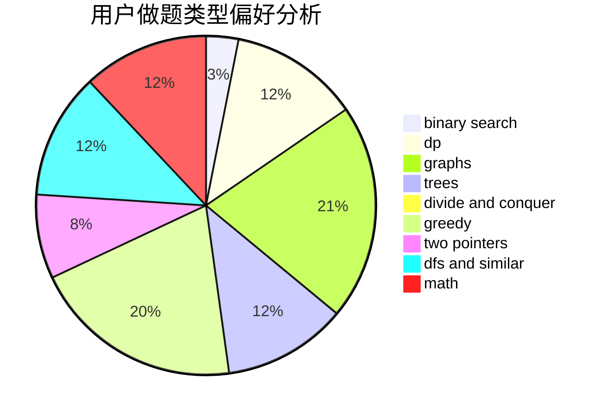

# ChenTingyang

<!-- tabs:start -->

#### **用户提交结果分析**

#### **用户做题类型偏好分析**

<!-- tabs:end -->
# 推荐题目
[699A](https://codeforces.com/contest/699/problem/A)
[456B](https://codeforces.com/contest/456/problem/B)
[699C](https://codeforces.com/contest/699/problem/C)
[590A](https://codeforces.com/contest/590/problem/A)
[699D](https://codeforces.com/contest/699/problem/D)
[12622](https://codeforces.com/contest/1262/problem/2)
[652F](https://codeforces.com/contest/652/problem/F)
[699B](https://codeforces.com/contest/699/problem/B)
[698D](https://codeforces.com/contest/698/problem/D)
[457E](https://codeforces.com/contest/457/problem/E)
