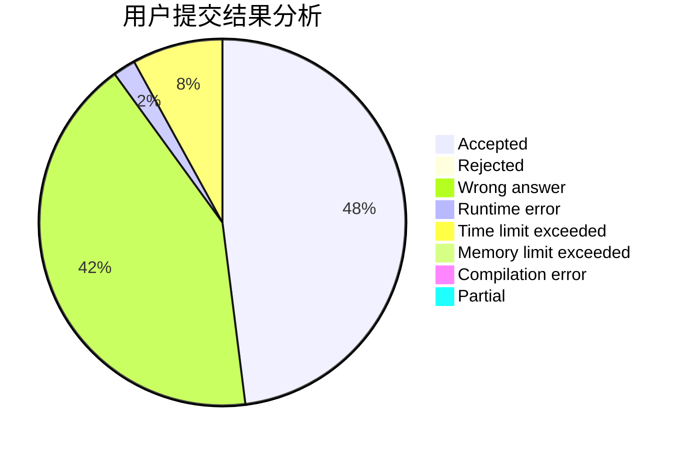
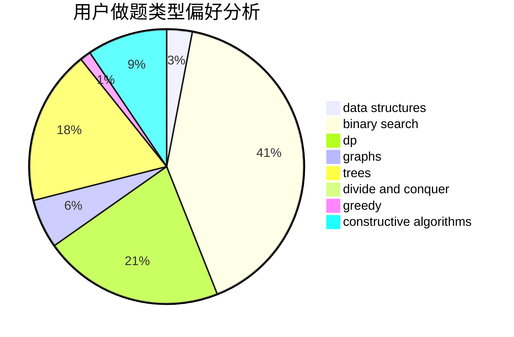
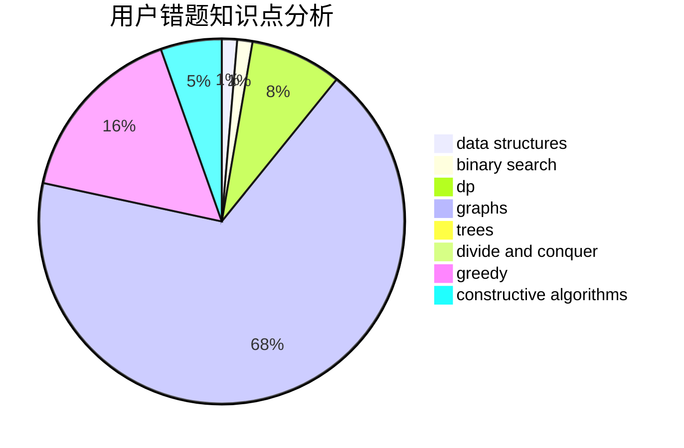

# zghtyarecrenj

<!-- tabs:start -->

#### **用户提交结果分析**

#### **用户做题类型偏好分析**

#### **用户错题知识点分析**

<!-- tabs:end -->
# 推荐题目
[1113D](https://codeforces.com/contest/1113/problem/D)		dsu,graphs,sortings,trees		  
[1248E](https://codeforces.com/contest/1248/problem/E)		dsu,graphs,sortings,trees		  
[960C](https://codeforces.com/contest/960/problem/C)		bitmasks,
                        constructive algorithms,
                        greedy,
                        implementation		  
[540A](https://codeforces.com/contest/540/problem/A)		implementation		  
[1252J](https://codeforces.com/contest/1252/problem/J)		brute force,
                        dp		  
[664A](https://codeforces.com/contest/664/problem/A)		math,
                        number theory		  
[925F](https://codeforces.com/contest/925/problem/F)		binary search,
                        flows		  
[167C](https://codeforces.com/contest/167/problem/C)		games,
                        math		  
[847B](https://codeforces.com/contest/847/problem/B)		binary search,
                        data structures		  
[438A](https://codeforces.com/contest/438/problem/A)		dsu,graphs,sortings,trees		  
