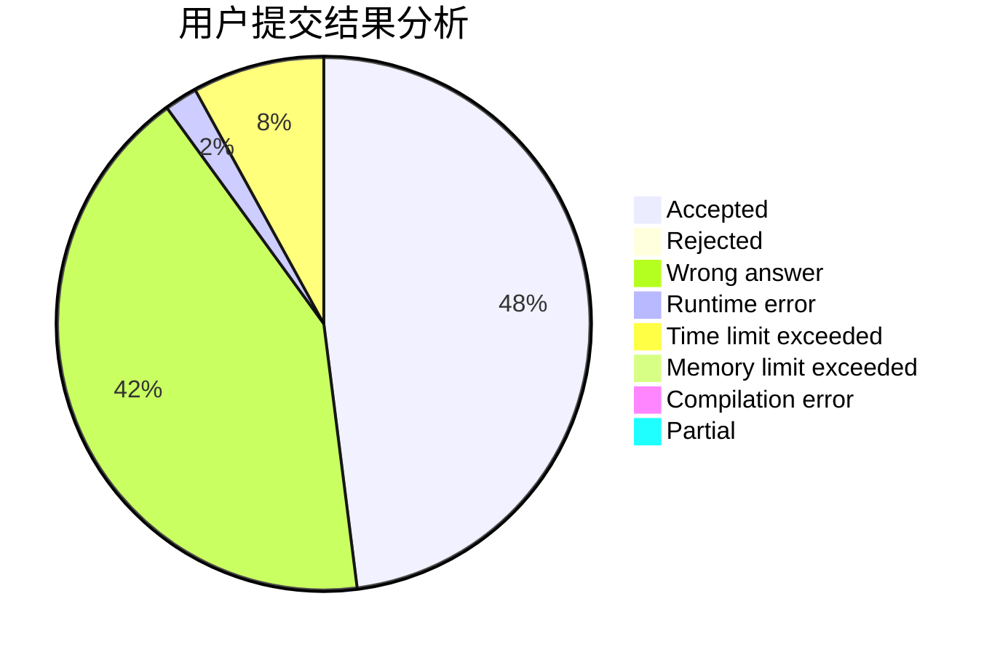
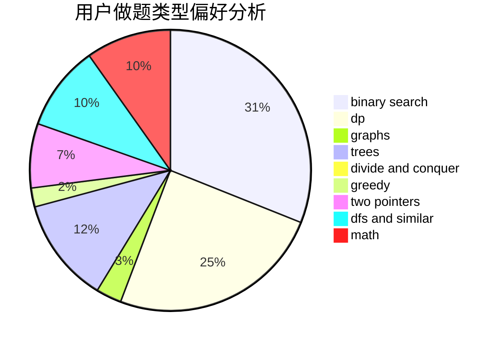

# zghtyarecrenj

<!-- tabs:start -->

#### **用户提交结果分析**

#### **用户做题类型偏好分析**

<!-- tabs:end -->
# 推荐题目
[1113D](https://codeforces.com/contest/1113/problem/D)
[1248E](https://codeforces.com/contest/1248/problem/E)
[960C](https://codeforces.com/contest/960/problem/C)
[540A](https://codeforces.com/contest/540/problem/A)
[1252J](https://codeforces.com/contest/1252/problem/J)
[664A](https://codeforces.com/contest/664/problem/A)
[925F](https://codeforces.com/contest/925/problem/F)
[167C](https://codeforces.com/contest/167/problem/C)
[847B](https://codeforces.com/contest/847/problem/B)
[438A](https://codeforces.com/contest/438/problem/A)
