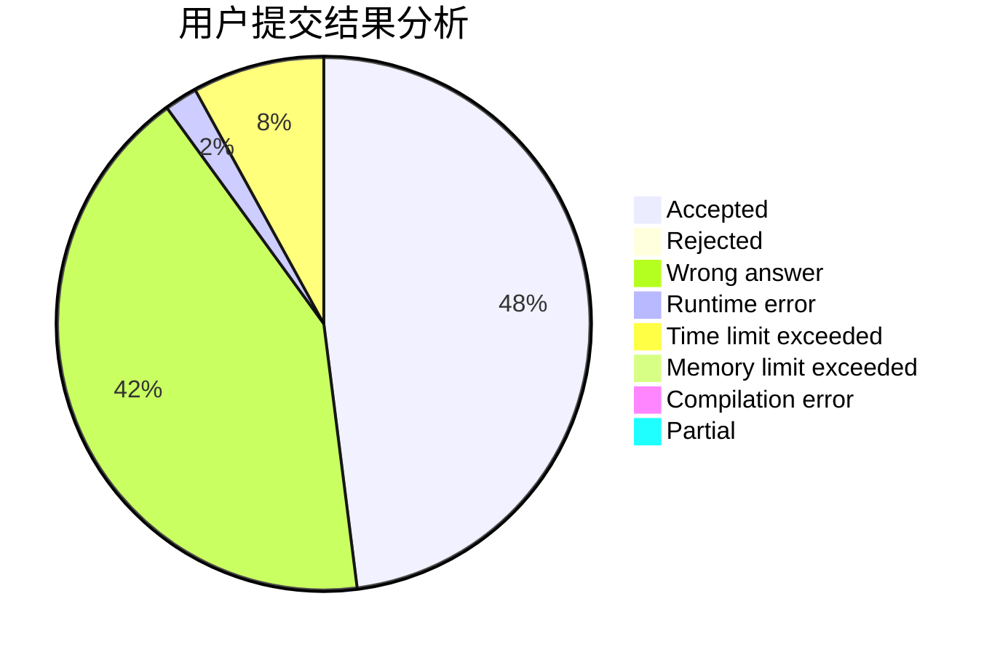
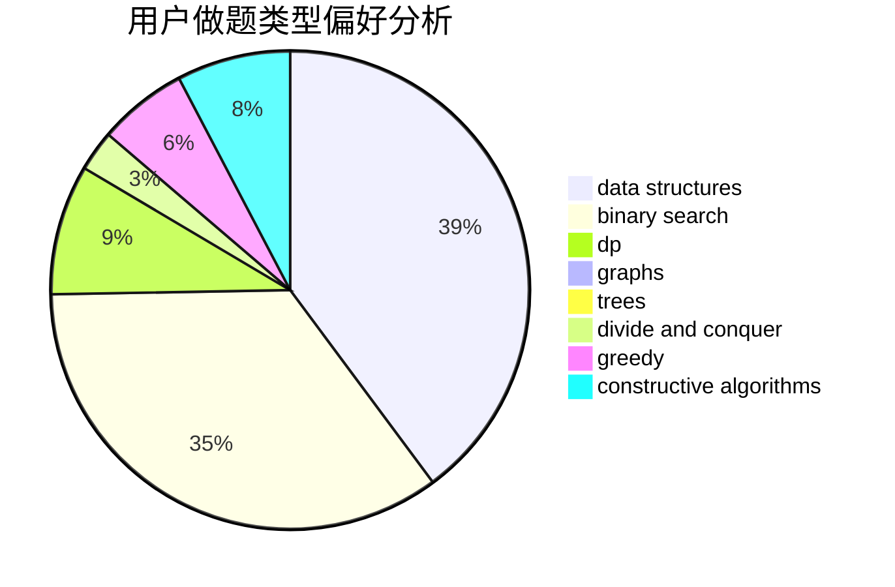
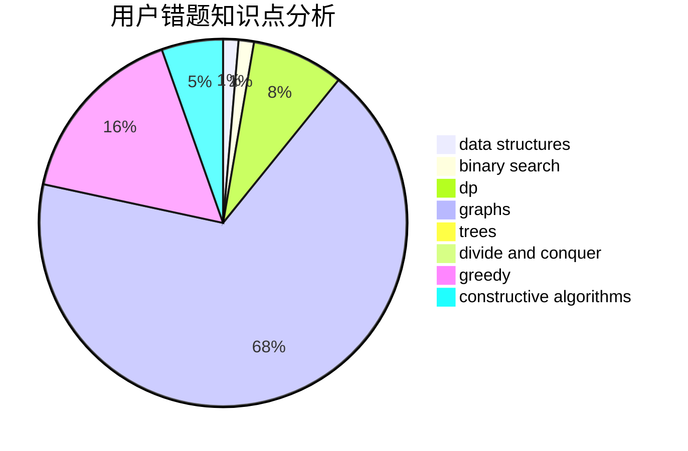

# zghtyarecrenj

<!-- tabs:start -->

#### **用户提交结果分析**

#### **用户做题类型偏好分析**

#### **用户错题知识点分析**

<!-- tabs:end -->
# 推荐题目
[1113A](https://codeforces.com/contest/1113/problem/A)		dp,
                        greedy,
                        math		  
[1243D](https://codeforces.com/contest/1243/problem/D)		dsu,graphs,sortings,trees		  
[938G](https://codeforces.com/contest/938/problem/G)		bitmasks,
                        data structures,
                        dsu,
                        graphs		  
[514C](https://codeforces.com/contest/514/problem/C)		binary search,
                        data structures,
                        hashing,
                        string suffix structures,
                        strings		  
[1249B1](https://codeforces.com/contest/1249B/problem/1)		dsu,
                        math		  
[632D](https://codeforces.com/contest/632/problem/D)		brute force,
                        math,
                        number theory		  
[911A](https://codeforces.com/contest/911/problem/A)		implementation		  
[1511B](https://codeforces.com/contest/1511/problem/B)		constructive algorithms,
                        math,
                        number theory		  
[828D](https://codeforces.com/contest/828/problem/D)		dsu,graphs,sortings,trees		  
[411A](https://codeforces.com/contest/411/problem/A)		*special problem,
                        implementation		  
