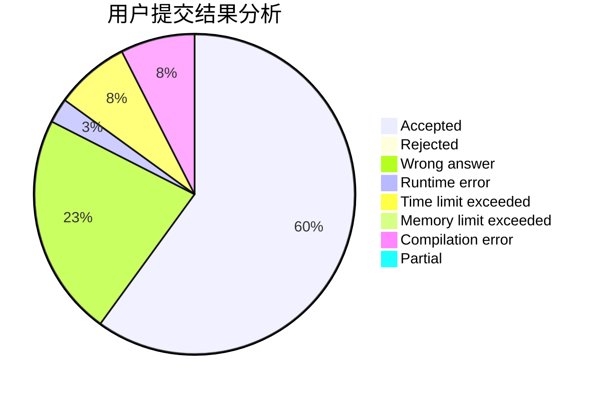
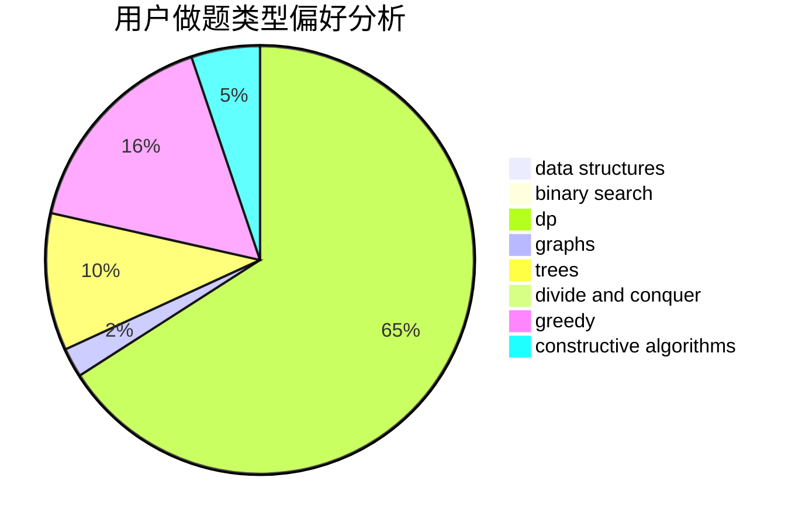

# zgyw

<!-- tabs:start -->

#### **用户提交结果分析**

#### **用户做题类型偏好分析**

#### **用户错题知识点分析**

<!-- tabs:end -->
# 推荐题目
[1033B](https://codeforces.com/contest/1033/problem/B)		math,
                        number theory		  
[547D](https://codeforces.com/contest/547/problem/D)		constructive algorithms,
                        dfs and similar,
                        graphs		  
[1491F](https://codeforces.com/contest/1491/problem/F)		binary search,
                        constructive algorithms,
                        interactive		  
[261E](https://codeforces.com/contest/261/problem/E)		brute force,
                        dp,
                        two pointers		  
[193D](https://codeforces.com/contest/193/problem/D)		data structures		  
[1167E](https://codeforces.com/contest/1167/problem/E)		binary search,
                        combinatorics,
                        data structures,
                        two pointers		  
[17C](https://codeforces.com/contest/17/problem/C)		dp		  
[785E](https://codeforces.com/contest/785/problem/E)		brute force,
                        data structures		  
[376A](https://codeforces.com/contest/376/problem/A)		implementation,
                        math		  
[145A](https://codeforces.com/contest/145/problem/A)		greedy,
                        implementation		  
