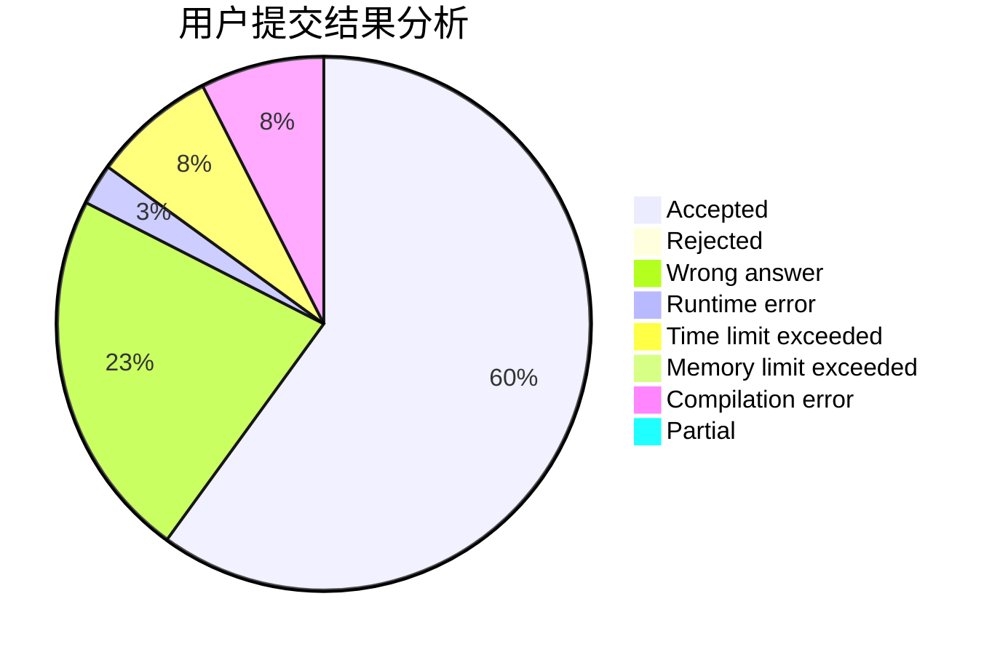
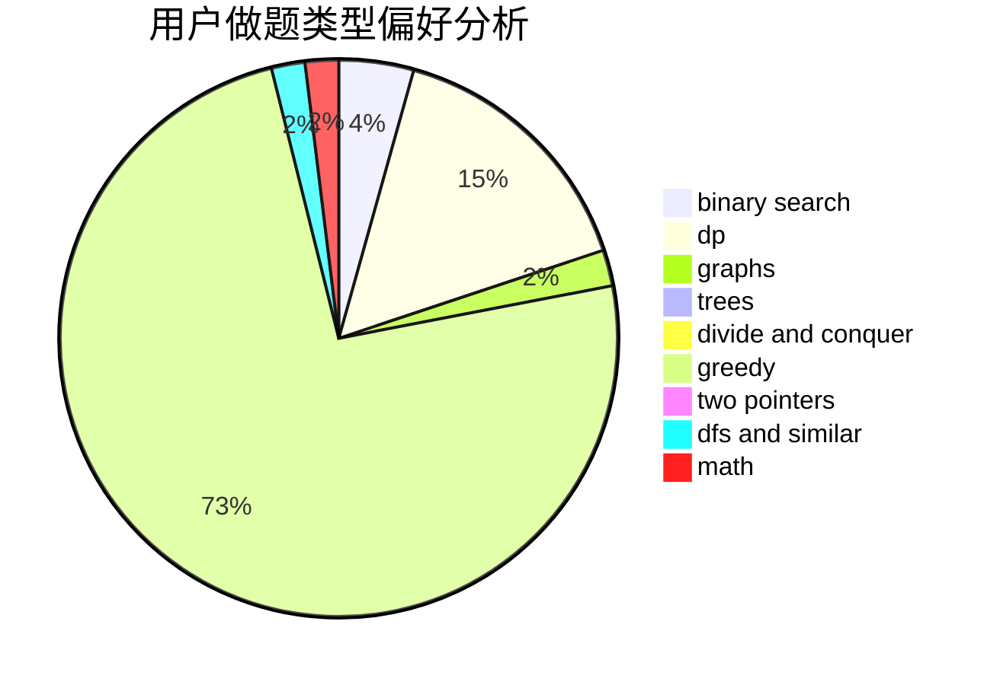

# zgyw

<!-- tabs:start -->

#### **用户提交结果分析**

#### **用户做题类型偏好分析**

<!-- tabs:end -->
# 推荐题目
[1033E](https://codeforces.com/contest/1033/problem/E)
[572A](https://codeforces.com/contest/572/problem/A)
[14C](https://codeforces.com/contest/14/problem/C)
[27C](https://codeforces.com/contest/27/problem/C)
[217D](https://codeforces.com/contest/217/problem/D)
[1172B](https://codeforces.com/contest/1172/problem/B)
[205B](https://codeforces.com/contest/205/problem/B)
[802J](https://codeforces.com/contest/802/problem/J)
[404C](https://codeforces.com/contest/404/problem/C)
[1468G](https://codeforces.com/contest/1468/problem/G)
