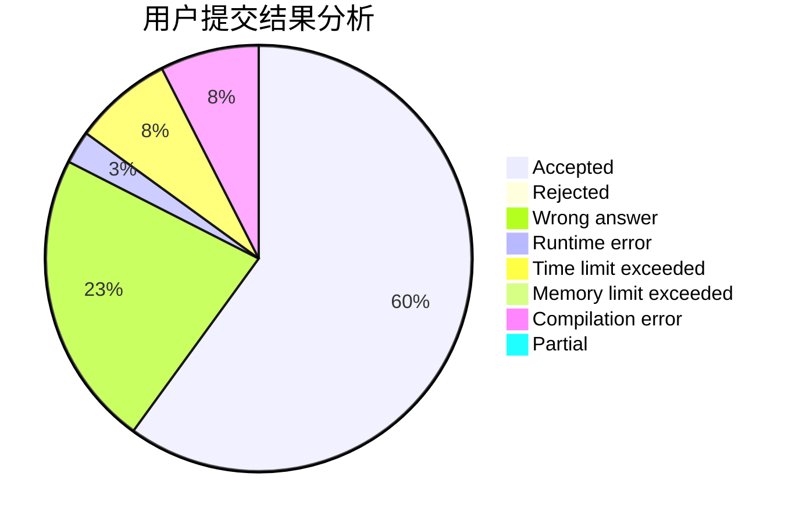
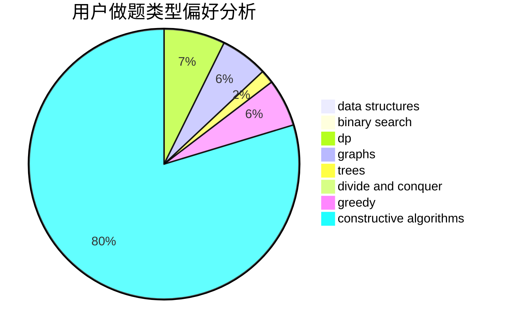

# zgyw

<!-- tabs:start -->

#### **用户提交结果分析**

#### **用户做题类型偏好分析**

#### **用户错题知识点分析**

<!-- tabs:end -->
# 推荐题目
[1033E](https://codeforces.com/contest/1033/problem/E)		binary search,
                        constructive algorithms,
                        dfs and similar,
                        graphs,
                        interactive		  
[572A](https://codeforces.com/contest/572/problem/A)		sortings		  
[14C](https://codeforces.com/contest/14/problem/C)		brute force,
                        constructive algorithms,
                        geometry,
                        implementation,
                        math		  
[27C](https://codeforces.com/contest/27/problem/C)		constructive algorithms,
                        greedy		  
[217D](https://codeforces.com/contest/217/problem/D)		bitmasks,
                        brute force,
                        combinatorics,
                        dfs and similar,
                        math		  
[1172B](https://codeforces.com/contest/1172/problem/B)		combinatorics,
                        dfs and similar,
                        dp,
                        trees		  
[205B](https://codeforces.com/contest/205/problem/B)		brute force,
                        greedy		  
[802J](https://codeforces.com/contest/802/problem/J)		dfs and similar,
                        graphs,
                        trees		  
[404C](https://codeforces.com/contest/404/problem/C)		dfs and similar,
                        graphs,
                        sortings		  
[1468G](https://codeforces.com/contest/1468/problem/G)		binary search,
                        geometry		  
