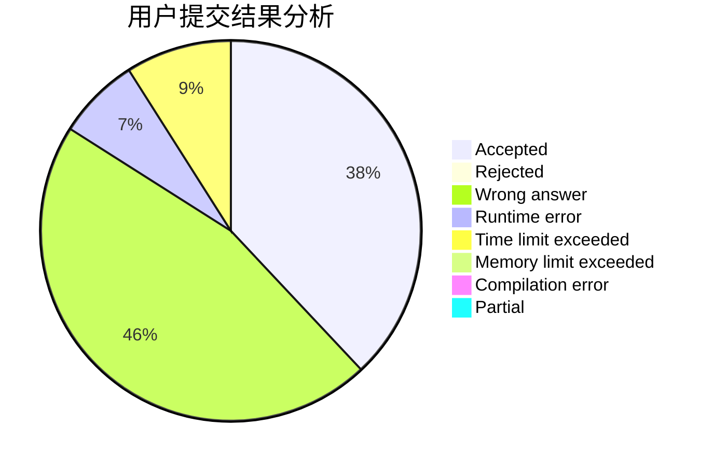
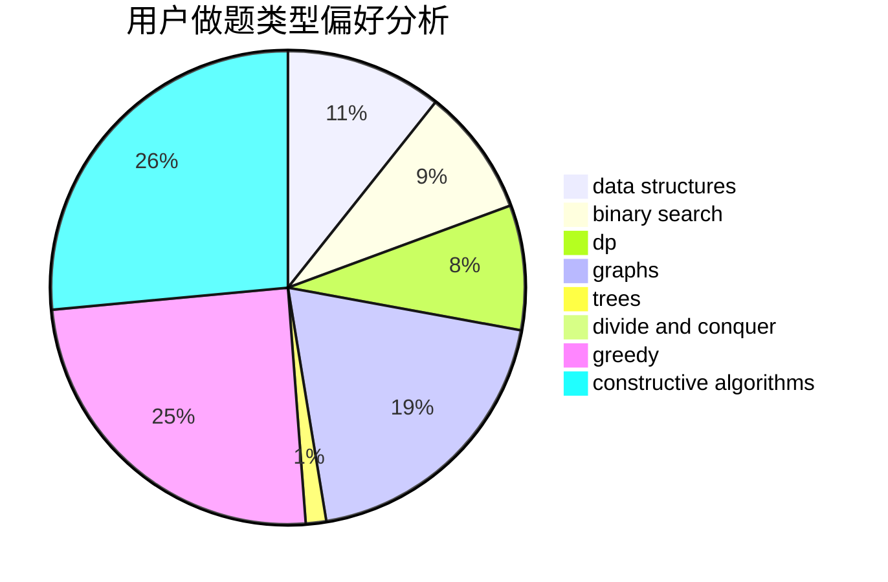

# zhang0617

<!-- tabs:start -->

#### **用户提交结果分析**

#### **用户做题类型偏好分析**

#### **用户错题知识点分析**

<!-- tabs:end -->
# 推荐题目
[544E](https://codeforces.com/contest/544/problem/E)		dsu,graphs,sortings,trees		  
[719C](https://codeforces.com/contest/719/problem/C)		dsu,graphs,sortings,trees		  
[160A](https://codeforces.com/contest/160/problem/A)		greedy,
                        sortings		  
[1430F](https://codeforces.com/contest/1430/problem/F)		dp,
                        greedy		  
[863B](https://codeforces.com/contest/863/problem/B)		brute force,
                        greedy,
                        sortings		  
[122A](https://codeforces.com/contest/122/problem/A)		brute force,
                        number theory		  
[1505F](https://codeforces.com/contest/1505/problem/F)		math		  
[916B](https://codeforces.com/contest/916/problem/B)		bitmasks,
                        greedy,
                        math		  
[976E](https://codeforces.com/contest/976/problem/E)		greedy,
                        sortings		  
[660A](https://codeforces.com/contest/660/problem/A)		greedy,
                        implementation,
                        math,
                        number theory		  
