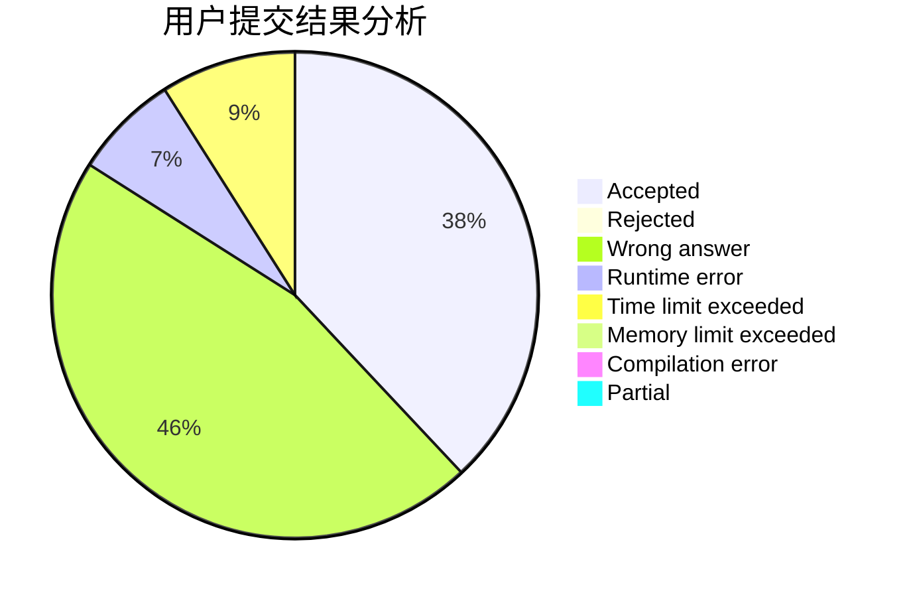
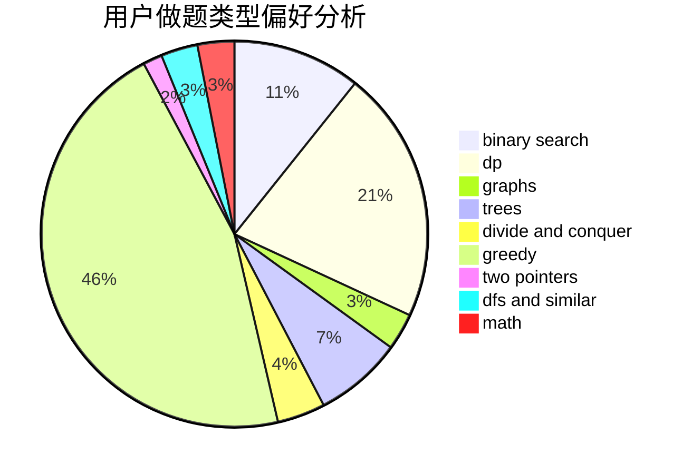

# zhang0617

<!-- tabs:start -->

#### **用户提交结果分析**

#### **用户做题类型偏好分析**

<!-- tabs:end -->
# 推荐题目
[569B](https://codeforces.com/contest/569/problem/B)
[736D](https://codeforces.com/contest/736/problem/D)
[183D](https://codeforces.com/contest/183/problem/D)
[1439D](https://codeforces.com/contest/1439/problem/D)
[883D](https://codeforces.com/contest/883/problem/D)
[1238B](https://codeforces.com/contest/1238/problem/B)
[155A](https://codeforces.com/contest/155/problem/A)
[936B](https://codeforces.com/contest/936/problem/B)
[990D](https://codeforces.com/contest/990/problem/D)
[680B](https://codeforces.com/contest/680/problem/B)
