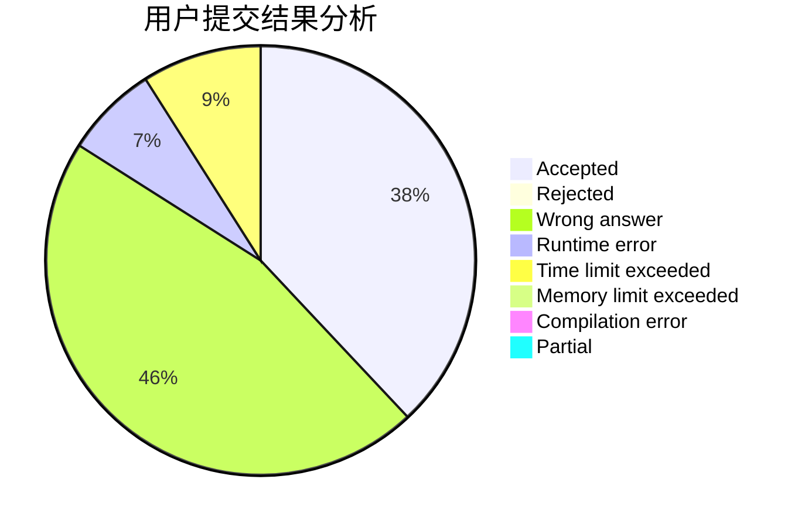
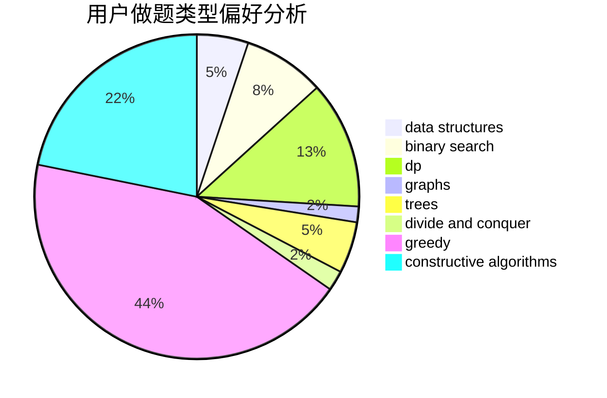

# zhang0617

<!-- tabs:start -->

#### **用户提交结果分析**

#### **用户做题类型偏好分析**

#### **用户错题知识点分析**

<!-- tabs:end -->
# 推荐题目
[569B](https://codeforces.com/contest/569/problem/B)		greedy,
                        math		  
[736D](https://codeforces.com/contest/736/problem/D)		math,
                        matrices		  
[183D](https://codeforces.com/contest/183/problem/D)		dp,
                        greedy,
                        probabilities		  
[1439D](https://codeforces.com/contest/1439/problem/D)		combinatorics,
                        dp,
                        fft		  
[883D](https://codeforces.com/contest/883/problem/D)		binary search,
                        dp,
                        math		  
[1238B](https://codeforces.com/contest/1238/problem/B)		greedy,
                        sortings		  
[155A](https://codeforces.com/contest/155/problem/A)		brute force		  
[936B](https://codeforces.com/contest/936/problem/B)		dfs and similar,
                        dp,
                        games,
                        graphs		  
[990D](https://codeforces.com/contest/990/problem/D)		constructive algorithms,
                        graphs,
                        implementation		  
[680B](https://codeforces.com/contest/680/problem/B)		constructive algorithms,
                        implementation		  
