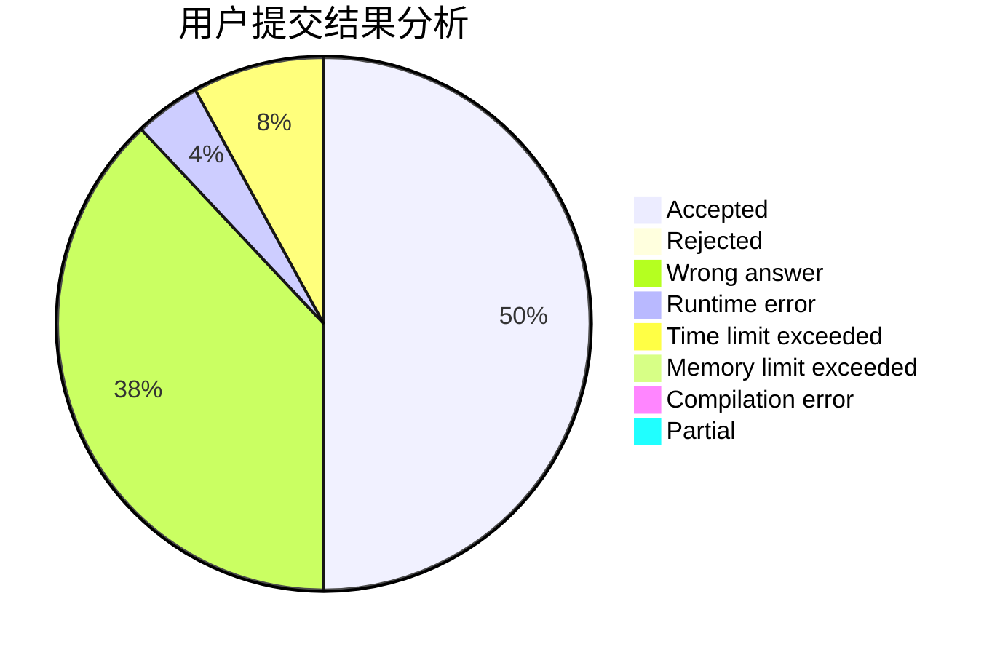
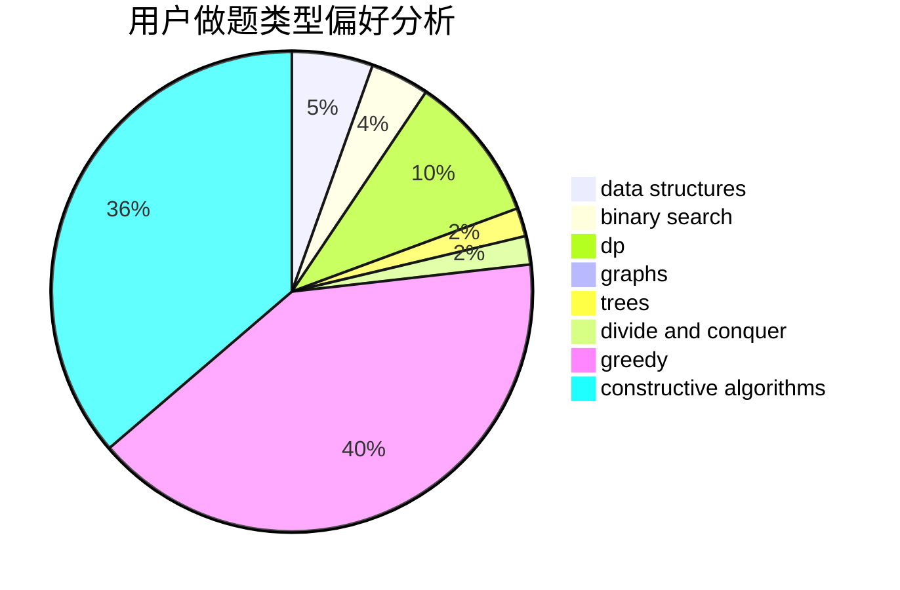

# zhang185

<!-- tabs:start -->

#### **用户提交结果分析**

#### **用户做题类型偏好分析**

#### **用户错题知识点分析**

<!-- tabs:end -->
# 推荐题目
[459E](https://codeforces.com/contest/459/problem/E)		dp,
                        sortings		  
[704C](https://codeforces.com/contest/704/problem/C)		dp,
                        graphs,
                        implementation,
                        math		  
[842D](https://codeforces.com/contest/842/problem/D)		binary search,
                        data structures		  
[883K](https://codeforces.com/contest/883/problem/K)		constructive algorithms,
                        greedy,
                        implementation		  
[1254B1](https://codeforces.com/contest/1254B/problem/1)		constructive algorithms,
                        greedy,
                        math,
                        number theory,
                        ternary search,
                        two pointers		  
[837G](https://codeforces.com/contest/837/problem/G)		data structures		  
[316A2](https://codeforces.com/contest/316A/problem/2)		math		  
[1162A](https://codeforces.com/contest/1162/problem/A)		implementation		  
[820A](https://codeforces.com/contest/820/problem/A)		implementation		  
[922B](https://codeforces.com/contest/922/problem/B)		brute force		  
