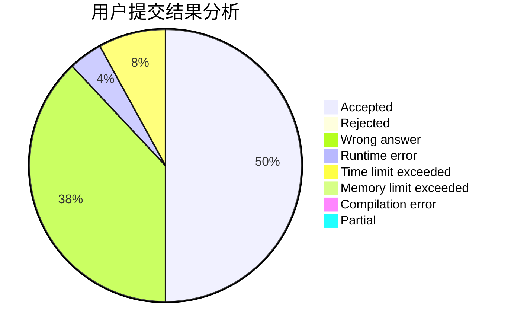
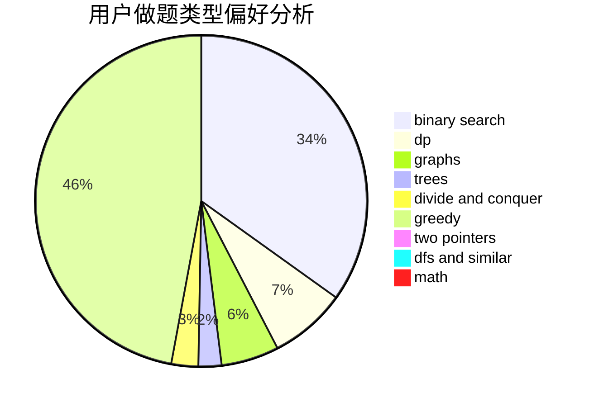

# zhang185

<!-- tabs:start -->

#### **用户提交结果分析**

#### **用户做题类型偏好分析**

<!-- tabs:end -->
# 推荐题目
[478D](https://codeforces.com/contest/478/problem/D)
[723C](https://codeforces.com/contest/723/problem/C)
[861C](https://codeforces.com/contest/861/problem/C)
[901D](https://codeforces.com/contest/901/problem/D)
[1261C](https://codeforces.com/contest/1261/problem/C)
[855E](https://codeforces.com/contest/855/problem/E)
[33A](https://codeforces.com/contest/33/problem/A)
[1164H](https://codeforces.com/contest/1164/problem/H)
[840A](https://codeforces.com/contest/840/problem/A)
[946B](https://codeforces.com/contest/946/problem/B)
