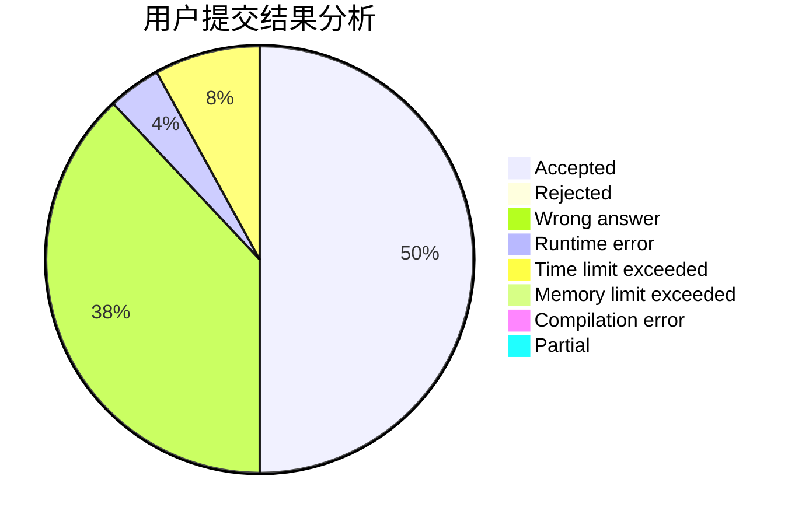
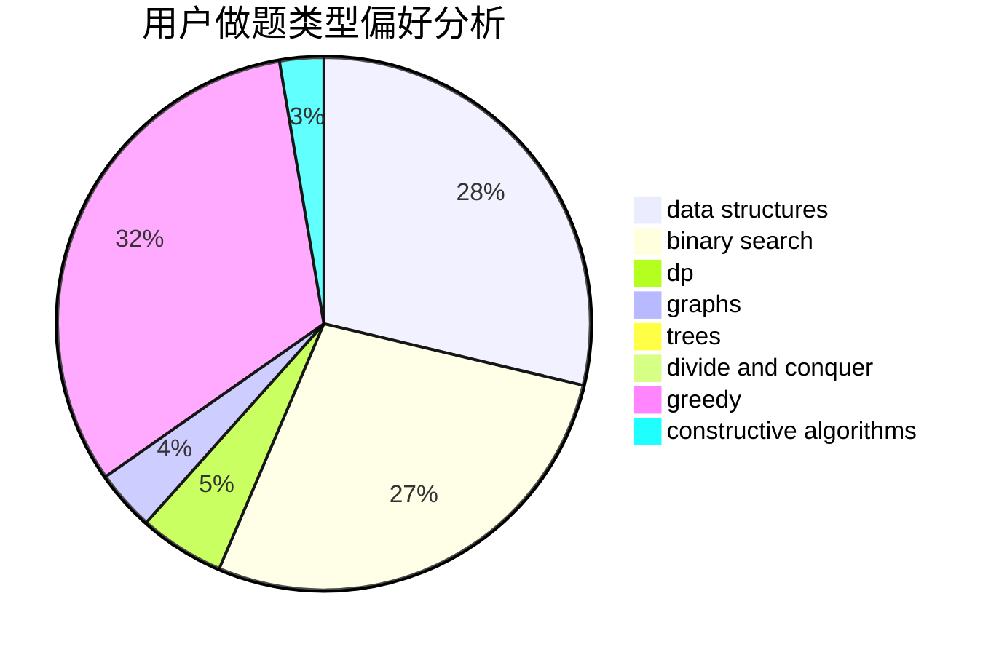
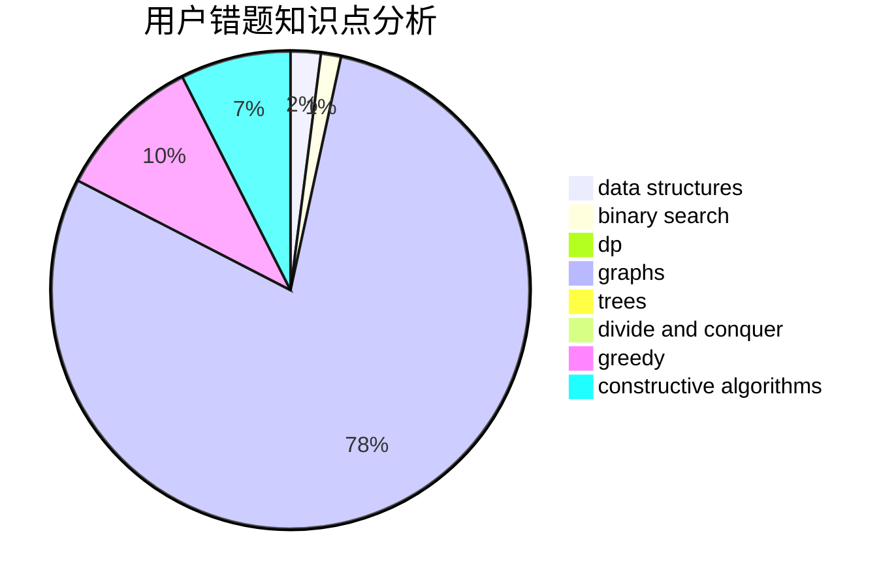

# zhang185

<!-- tabs:start -->

#### **用户提交结果分析**

#### **用户做题类型偏好分析**

#### **用户错题知识点分析**

<!-- tabs:end -->
# 推荐题目
[478D](https://codeforces.com/contest/478/problem/D)		dp		  
[723C](https://codeforces.com/contest/723/problem/C)		greedy		  
[861C](https://codeforces.com/contest/861/problem/C)		dsu,graphs,sortings,trees		  
[901D](https://codeforces.com/contest/901/problem/D)		constructive algorithms,
                        dfs and similar,
                        graphs		  
[1261C](https://codeforces.com/contest/1261/problem/C)		dsu,graphs,sortings,trees		  
[855E](https://codeforces.com/contest/855/problem/E)		bitmasks,
                        dp		  
[33A](https://codeforces.com/contest/33/problem/A)		greedy,
                        implementation		  
[1164H](https://codeforces.com/contest/1164/problem/H)		dsu,graphs,sortings,trees		  
[840A](https://codeforces.com/contest/840/problem/A)		combinatorics,
                        greedy,
                        math,
                        number theory,
                        sortings		  
[946B](https://codeforces.com/contest/946/problem/B)		math,
                        number theory		  
