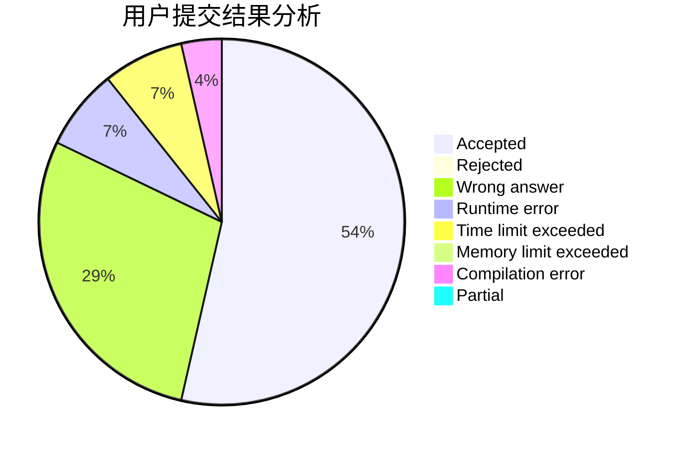
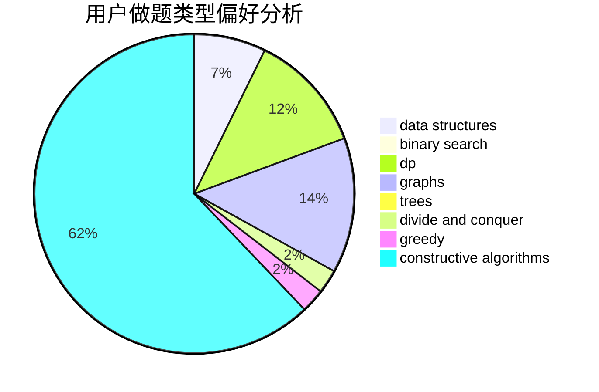

# zhangboju

<!-- tabs:start -->

#### **用户提交结果分析**

#### **用户做题类型偏好分析**

#### **用户错题知识点分析**

<!-- tabs:end -->
# 推荐题目
[acmsguru7](https://codeforces.com/contest/acmsguru/problem/7)		dsu,graphs,sortings,trees		  
[848B](https://codeforces.com/contest/848/problem/B)		constructive algorithms,
                        data structures,
                        geometry,
                        implementation,
                        sortings,
                        two pointers		  
[746G](https://codeforces.com/contest/746/problem/G)		constructive algorithms,
                        graphs,
                        trees		  
[714B](https://codeforces.com/contest/714/problem/B)		implementation,
                        sortings		  
[496E](https://codeforces.com/contest/496/problem/E)		greedy,
                        sortings		  
[852G](https://codeforces.com/contest/852/problem/G)		implementation		  
[1062F](https://codeforces.com/contest/1062/problem/F)		dfs and similar,
                        graphs		  
[889E](https://codeforces.com/contest/889/problem/E)		binary search,
                        dp,
                        math		  
[1179A](https://codeforces.com/contest/1179/problem/A)		data structures,
                        implementation		  
[1157D](https://codeforces.com/contest/1157/problem/D)		constructive algorithms,
                        greedy,
                        math		  
