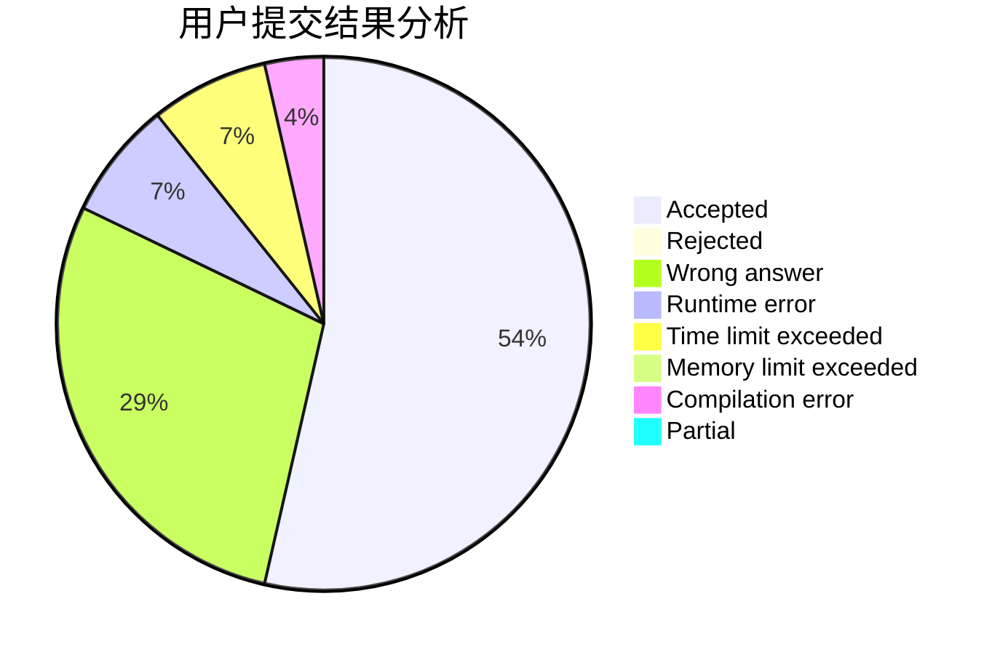
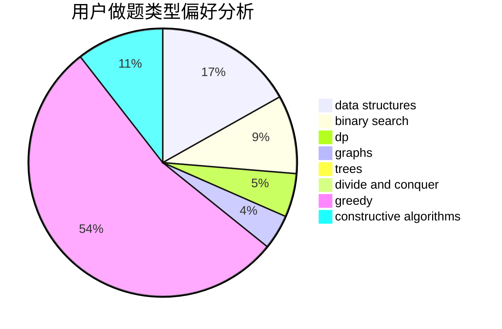

# zhangboju

<!-- tabs:start -->

#### **用户提交结果分析**

#### **用户做题类型偏好分析**

#### **用户错题知识点分析**

<!-- tabs:end -->
# 推荐题目
[986E](https://codeforces.com/contest/986/problem/E)		brute force,
                        data structures,
                        math,
                        number theory,
                        trees		  
[830B](https://codeforces.com/contest/830/problem/B)		data structures,
                        implementation,
                        sortings		  
[730A](https://codeforces.com/contest/730/problem/A)		greedy,
                        implementation		  
[698A](https://codeforces.com/contest/698/problem/A)		dp		  
[476E](https://codeforces.com/contest/476/problem/E)		dp,
                        strings		  
[835A](https://codeforces.com/contest/835/problem/A)		math		  
[1062C](https://codeforces.com/contest/1062/problem/C)		greedy,
                        implementation,
                        math		  
[86B](https://codeforces.com/contest/86/problem/B)		constructive algorithms,
                        graph matchings,
                        greedy,
                        math		  
[1175G](https://codeforces.com/contest/1175/problem/G)		data structures,
                        divide and conquer,
                        dp,
                        geometry,
                        two pointers		  
[1155E](https://codeforces.com/contest/1155/problem/E)		brute force,
                        interactive,
                        math		  
