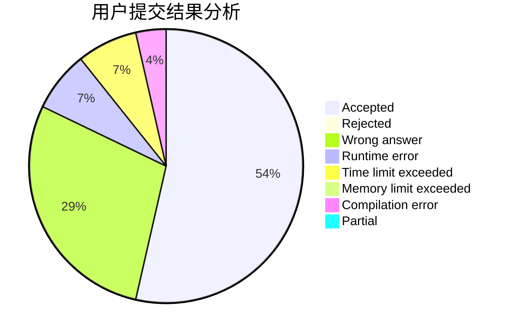
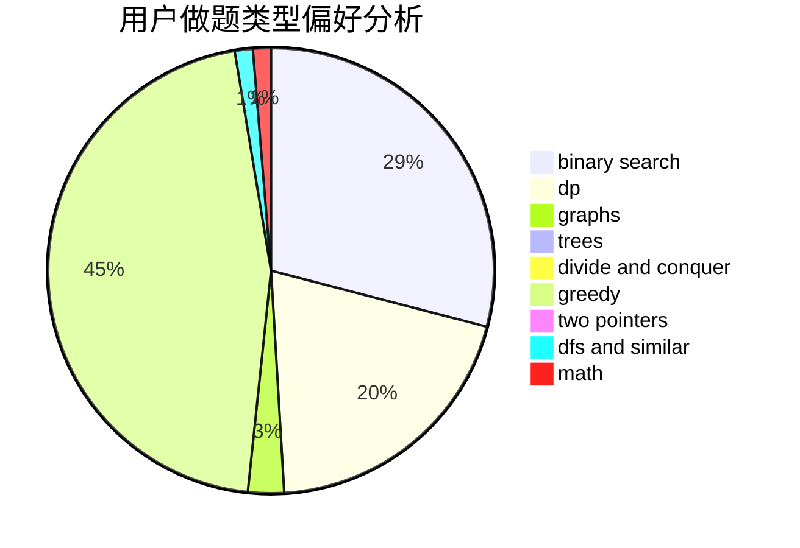

# zhangboju

<!-- tabs:start -->

#### **用户提交结果分析**

#### **用户做题类型偏好分析**

<!-- tabs:end -->
# 推荐题目
[acmsguru7](https://codeforces.com/contest/acmsguru/problem/7)
[848B](https://codeforces.com/contest/848/problem/B)
[746G](https://codeforces.com/contest/746/problem/G)
[714B](https://codeforces.com/contest/714/problem/B)
[496E](https://codeforces.com/contest/496/problem/E)
[852G](https://codeforces.com/contest/852/problem/G)
[1062F](https://codeforces.com/contest/1062/problem/F)
[889E](https://codeforces.com/contest/889/problem/E)
[1179A](https://codeforces.com/contest/1179/problem/A)
[1157D](https://codeforces.com/contest/1157/problem/D)
