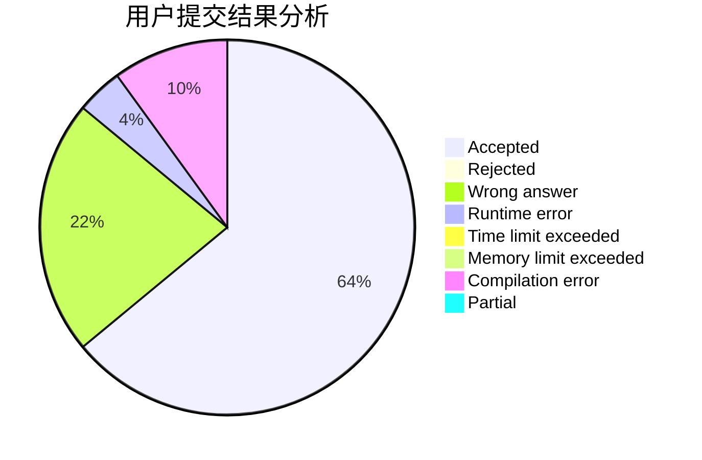
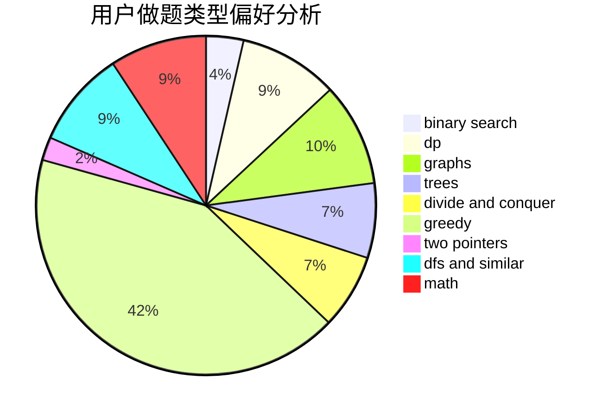

# zhanghengrui

<!-- tabs:start -->

#### **用户提交结果分析**

#### **用户做题类型偏好分析**

<!-- tabs:end -->
# 推荐题目
[367B](https://codeforces.com/contest/367/problem/B)
[912C](https://codeforces.com/contest/912/problem/C)
[234A](https://codeforces.com/contest/234/problem/A)
[1016E](https://codeforces.com/contest/1016/problem/E)
[821B](https://codeforces.com/contest/821/problem/B)
[597B](https://codeforces.com/contest/597/problem/B)
[430C](https://codeforces.com/contest/430/problem/C)
[620B](https://codeforces.com/contest/620/problem/B)
[866E](https://codeforces.com/contest/866/problem/E)
[750A](https://codeforces.com/contest/750/problem/A)
