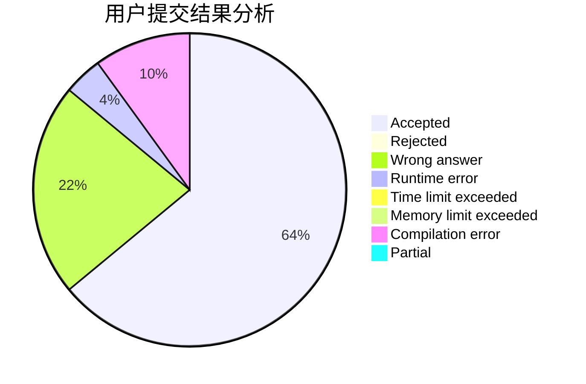
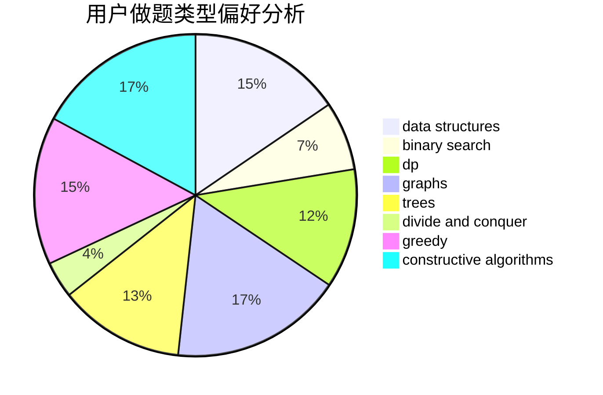

# zhanghengrui

<!-- tabs:start -->

#### **用户提交结果分析**

#### **用户做题类型偏好分析**

#### **用户错题知识点分析**

<!-- tabs:end -->
# 推荐题目
[33A](https://codeforces.com/contest/33/problem/A)		greedy,
                        implementation		  
[894D](https://codeforces.com/contest/894/problem/D)		brute force,
                        data structures,
                        trees		  
[215B](https://codeforces.com/contest/215/problem/B)		greedy,
                        math		  
[1016B](https://codeforces.com/contest/1016/problem/B)		brute force,
                        implementation		  
[805A](https://codeforces.com/contest/805/problem/A)		greedy,
                        math		  
[575G](https://codeforces.com/contest/575/problem/G)		dfs and similar,
                        shortest paths		  
[402C](https://codeforces.com/contest/402/problem/C)		brute force,
                        constructive algorithms,
                        graphs		  
[600F](https://codeforces.com/contest/600/problem/F)		graphs		  
[848B](https://codeforces.com/contest/848/problem/B)		constructive algorithms,
                        data structures,
                        geometry,
                        implementation,
                        sortings,
                        two pointers		  
[732B](https://codeforces.com/contest/732/problem/B)		dp,
                        greedy		  
