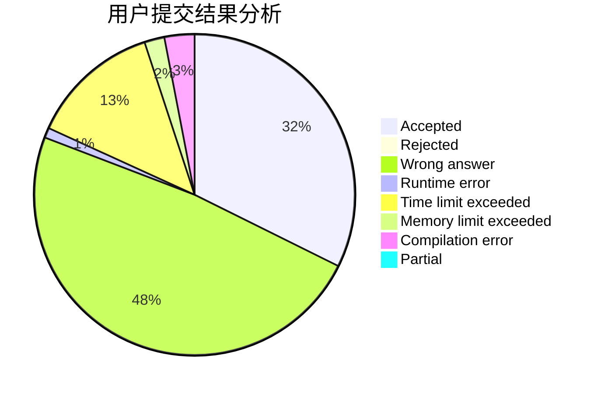
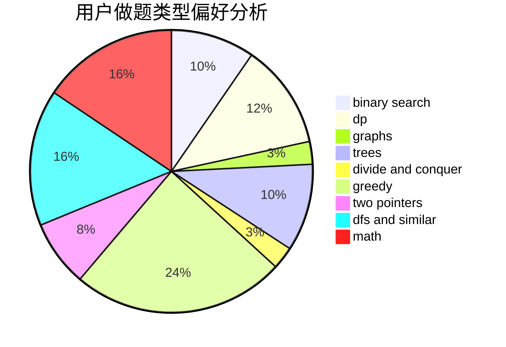

# zhanglichen

<!-- tabs:start -->

#### **用户提交结果分析**

#### **用户做题类型偏好分析**

<!-- tabs:end -->
# 推荐题目
[1337C](https://codeforces.com/contest/1337/problem/C)
[1454A](https://codeforces.com/contest/1454/problem/A)
[1342C](https://codeforces.com/contest/1342/problem/C)
[13822](https://codeforces.com/contest/1382/problem/2)
[899D](https://codeforces.com/contest/899/problem/D)
[838E](https://codeforces.com/contest/838/problem/E)
[1145B](https://codeforces.com/contest/1145/problem/B)
[405A](https://codeforces.com/contest/405/problem/A)
[846E](https://codeforces.com/contest/846/problem/E)
[11412](https://codeforces.com/contest/1141/problem/2)
