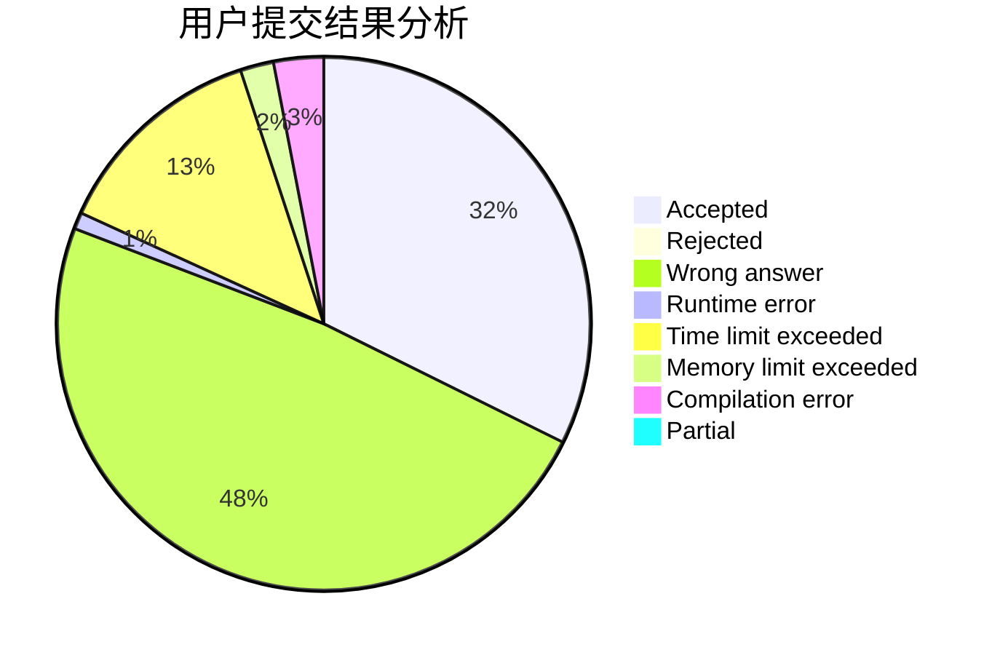
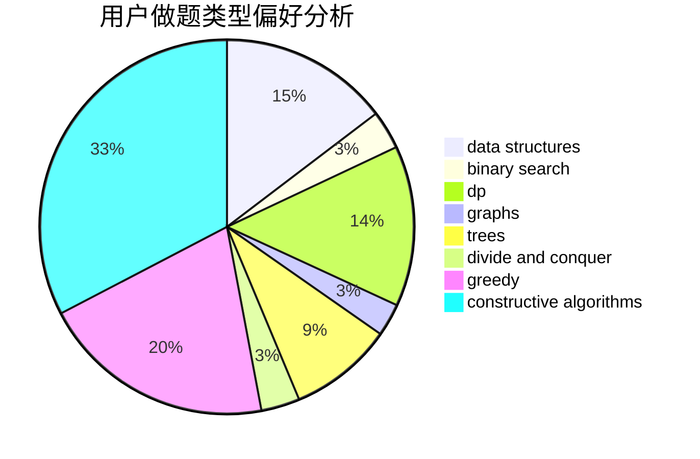
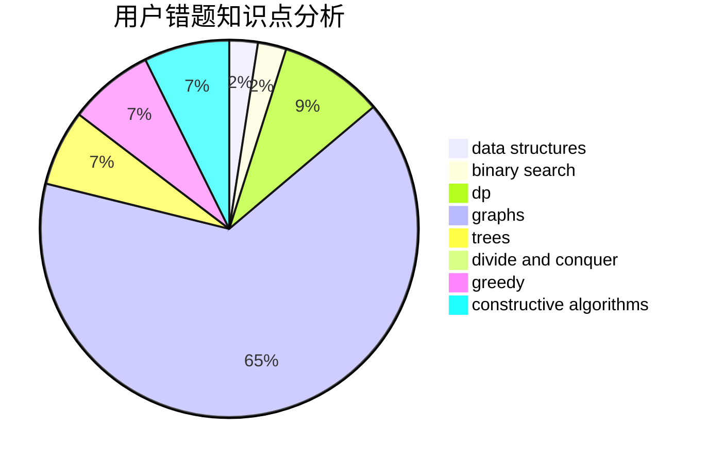

# zhanglichen

<!-- tabs:start -->

#### **用户提交结果分析**

#### **用户做题类型偏好分析**

#### **用户错题知识点分析**

<!-- tabs:end -->
# 推荐题目
[1337C](https://codeforces.com/contest/1337/problem/C)		dsu,graphs,sortings,trees		  
[1454A](https://codeforces.com/contest/1454/problem/A)		constructive algorithms,
                        probabilities		  
[1342C](https://codeforces.com/contest/1342/problem/C)		math,
                        number theory		  
[13822](https://codeforces.com/contest/1382/problem/2)		dsu,graphs,sortings,trees		  
[899D](https://codeforces.com/contest/899/problem/D)		constructive algorithms,
                        math		  
[838E](https://codeforces.com/contest/838/problem/E)		dp		  
[1145B](https://codeforces.com/contest/1145/problem/B)		brute force		  
[405A](https://codeforces.com/contest/405/problem/A)		greedy,
                        implementation,
                        sortings		  
[846E](https://codeforces.com/contest/846/problem/E)		dfs and similar,
                        greedy,
                        trees		  
[11412](https://codeforces.com/contest/1141/problem/2)		dsu,graphs,sortings,trees		  
