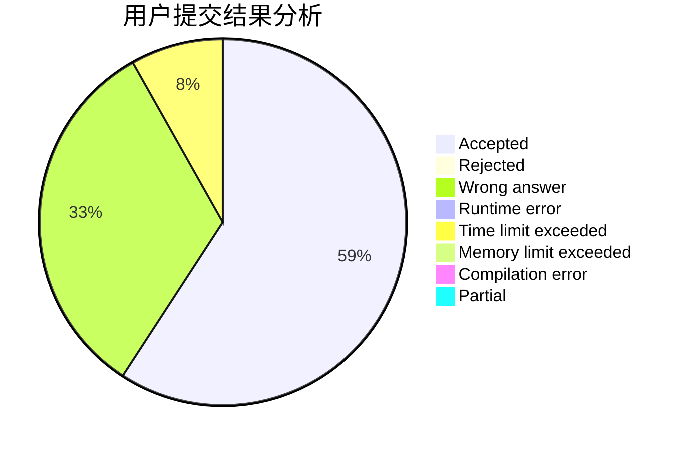
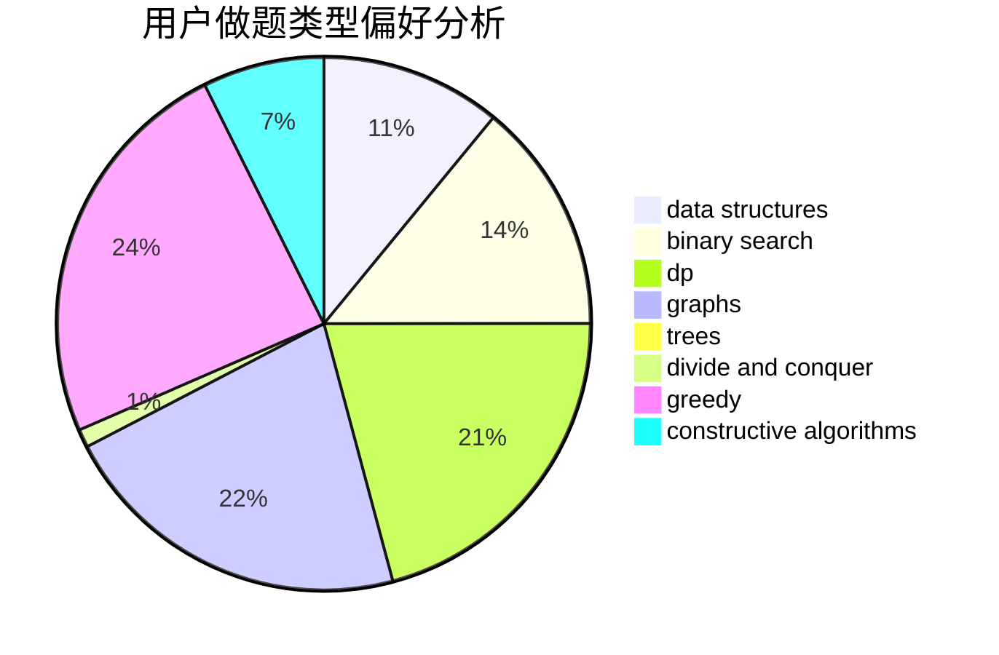
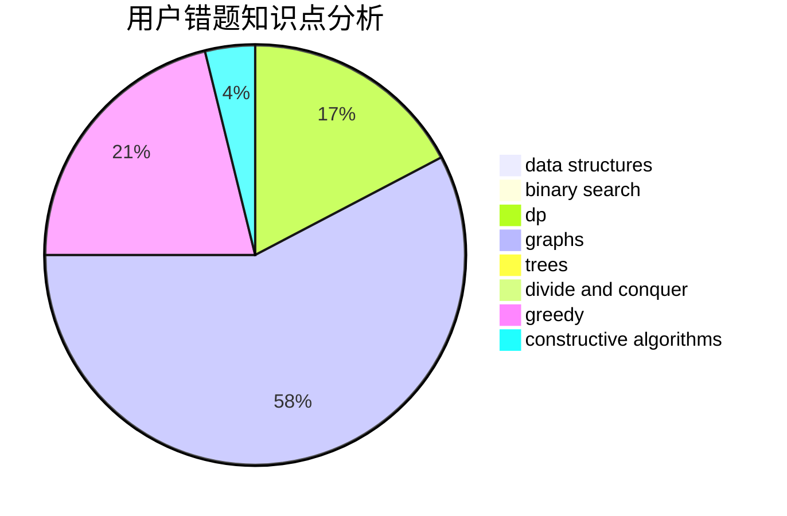

# zhangpuyang

<!-- tabs:start -->

#### **用户提交结果分析**

#### **用户做题类型偏好分析**

#### **用户错题知识点分析**

<!-- tabs:end -->
# 推荐题目
[1451E1](https://codeforces.com/contest/1451E/problem/1)		bitmasks,
                        constructive algorithms,
                        interactive,
                        math		  
[1511A](https://codeforces.com/contest/1511/problem/A)		greedy		  
[1103E](https://codeforces.com/contest/1103/problem/E)		fft,
                        math,
                        number theory		  
[1118A](https://codeforces.com/contest/1118/problem/A)		math		  
[3C](https://codeforces.com/contest/3/problem/C)		brute force,
                        games,
                        implementation		  
[191C](https://codeforces.com/contest/191/problem/C)		data structures,
                        dfs and similar,
                        trees		  
[777D](https://codeforces.com/contest/777/problem/D)		binary search,
                        greedy,
                        implementation,
                        strings		  
[445B](https://codeforces.com/contest/445/problem/B)		dfs and similar,
                        dsu,
                        greedy		  
[376B](https://codeforces.com/contest/376/problem/B)		implementation		  
[812A](https://codeforces.com/contest/812/problem/A)		implementation		  
