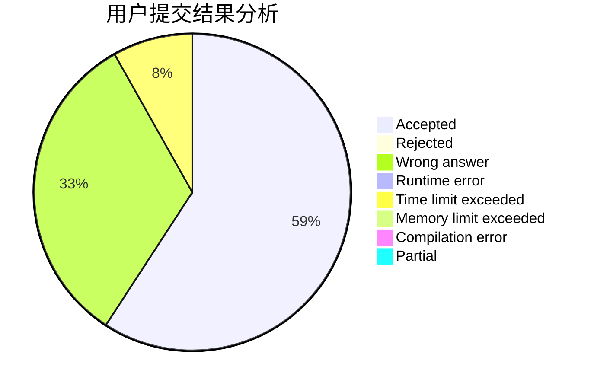
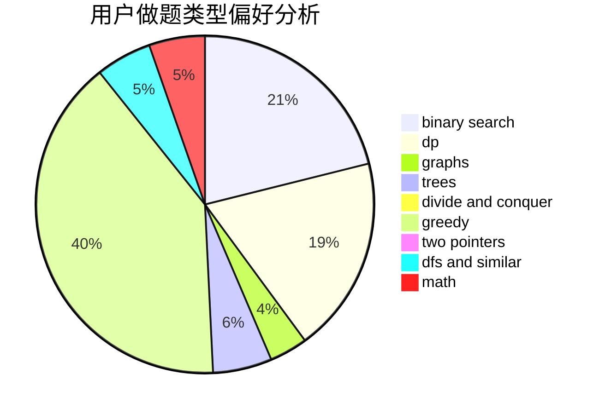

# zhangpuyang

<!-- tabs:start -->

#### **用户提交结果分析**

#### **用户做题类型偏好分析**

<!-- tabs:end -->
# 推荐题目
[1461A](https://codeforces.com/contest/1461/problem/A)
[167B](https://codeforces.com/contest/167/problem/B)
[1104C](https://codeforces.com/contest/1104/problem/C)
[1119F](https://codeforces.com/contest/1119/problem/F)
[429D](https://codeforces.com/contest/429/problem/D)
[216A](https://codeforces.com/contest/216/problem/A)
[796A](https://codeforces.com/contest/796/problem/A)
[465D](https://codeforces.com/contest/465/problem/D)
[405A](https://codeforces.com/contest/405/problem/A)
[830D](https://codeforces.com/contest/830/problem/D)
