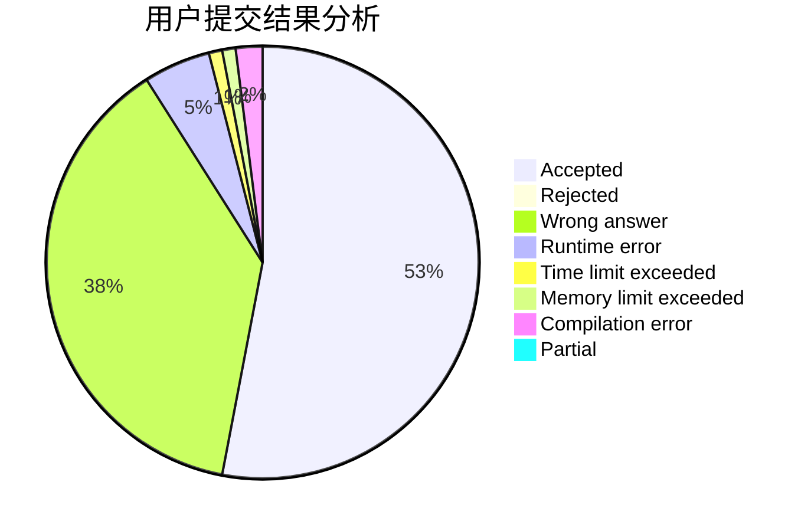
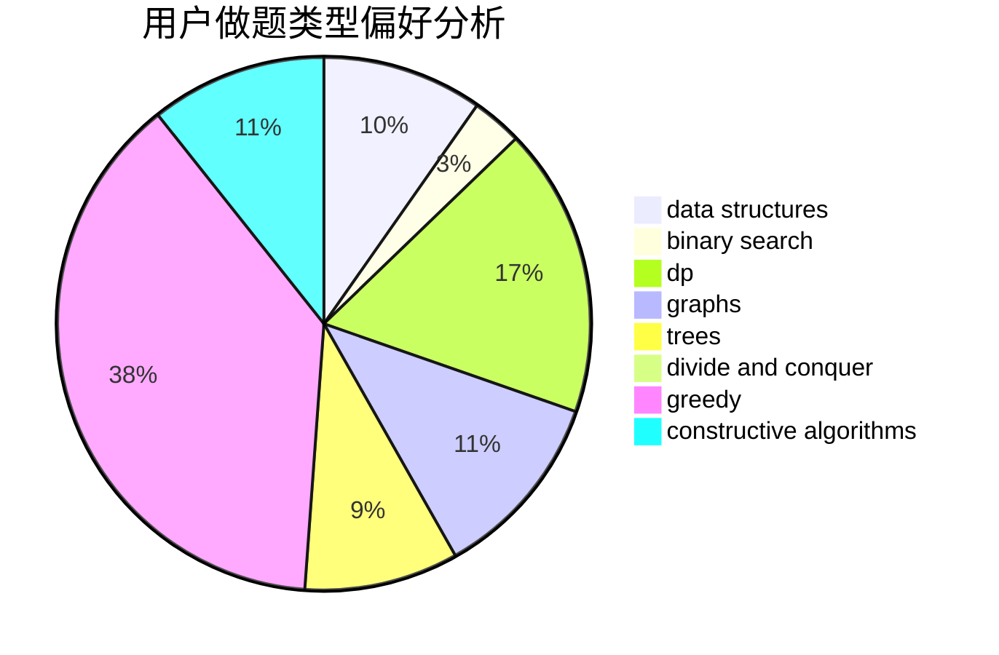
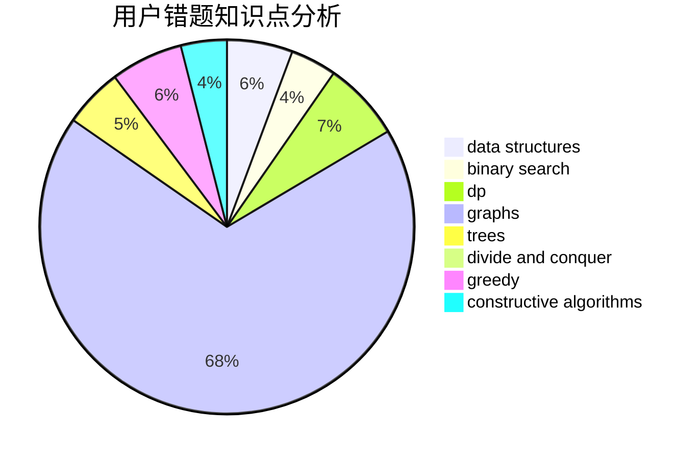

# zhangxiao

<!-- tabs:start -->

#### **用户提交结果分析**

#### **用户做题类型偏好分析**

#### **用户错题知识点分析**

<!-- tabs:end -->
# 推荐题目
[1487B](https://codeforces.com/contest/1487/problem/B)		math,
                        number theory		  
[1504C](https://codeforces.com/contest/1504/problem/C)		dsu,graphs,sortings,trees		  
[1470C](https://codeforces.com/contest/1470/problem/C)		binary search,
                        brute force,
                        constructive algorithms,
                        interactive		  
[1346B](https://codeforces.com/contest/1346/problem/B)		*special problem,
                        greedy		  
[1285B](https://codeforces.com/contest/1285/problem/B)		dp,
                        greedy,
                        implementation		  
[977A](https://codeforces.com/contest/977/problem/A)		implementation		  
[56B](https://codeforces.com/contest/56/problem/B)		implementation		  
[888E](https://codeforces.com/contest/888/problem/E)		bitmasks,
                        divide and conquer,
                        meet-in-the-middle		  
[1238F](https://codeforces.com/contest/1238/problem/F)		dfs and similar,
                        dp,
                        graphs,
                        trees		  
[685B](https://codeforces.com/contest/685/problem/B)		data structures,
                        dfs and similar,
                        dp,
                        trees		  
