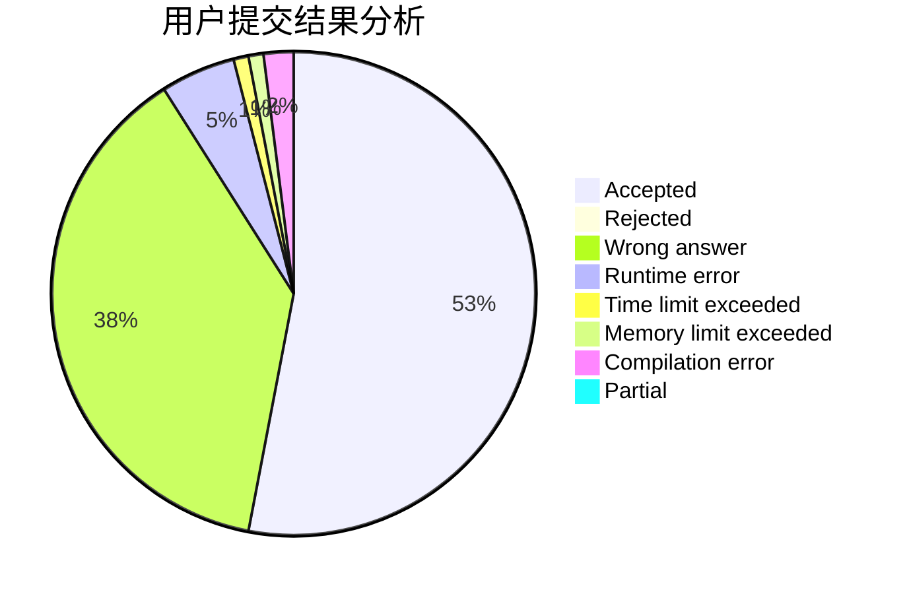
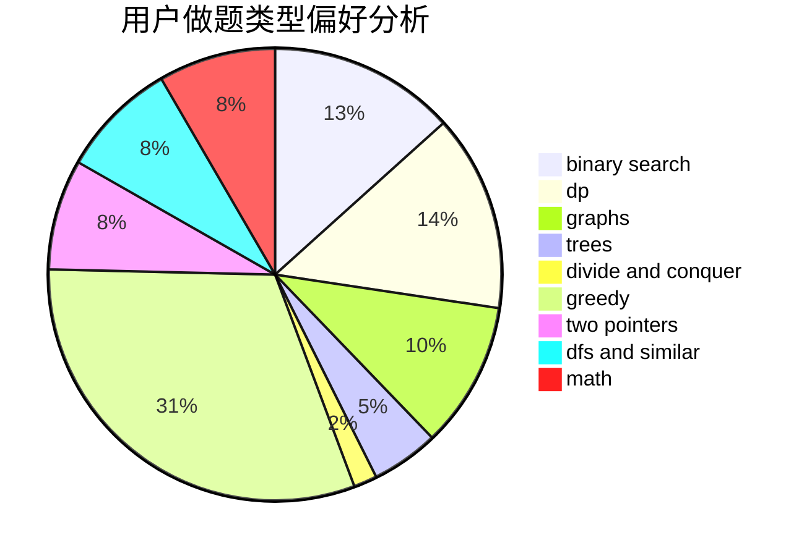

# zhangxiao

<!-- tabs:start -->

#### **用户提交结果分析**

#### **用户做题类型偏好分析**

<!-- tabs:end -->
# 推荐题目
[1494E](https://codeforces.com/contest/1494/problem/E)
[1513B](https://codeforces.com/contest/1513/problem/B)
[1478F](https://codeforces.com/contest/1478/problem/F)
[1353C](https://codeforces.com/contest/1353/problem/C)
[1292C](https://codeforces.com/contest/1292/problem/C)
[990F](https://codeforces.com/contest/990/problem/F)
[58E](https://codeforces.com/contest/58/problem/E)
[908C](https://codeforces.com/contest/908/problem/C)
[1244A](https://codeforces.com/contest/1244/problem/A)
[707D](https://codeforces.com/contest/707/problem/D)
