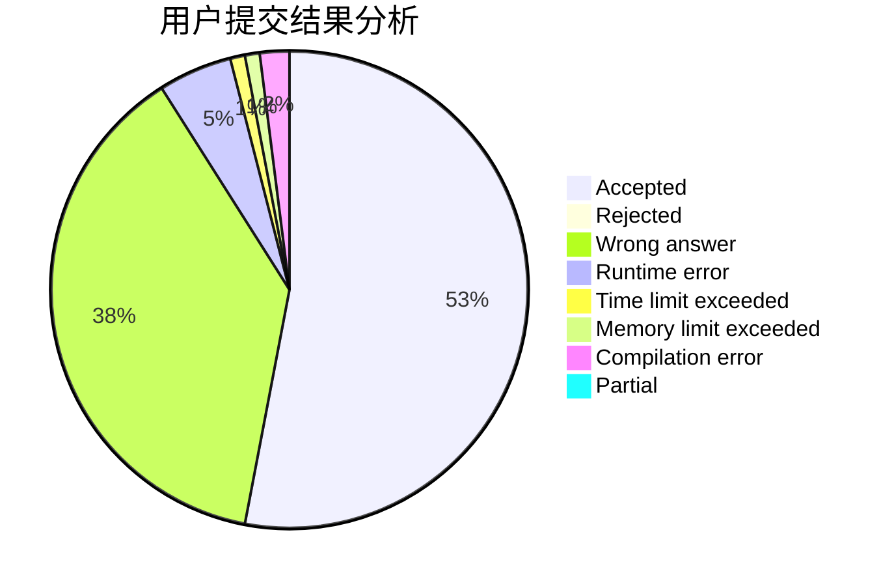
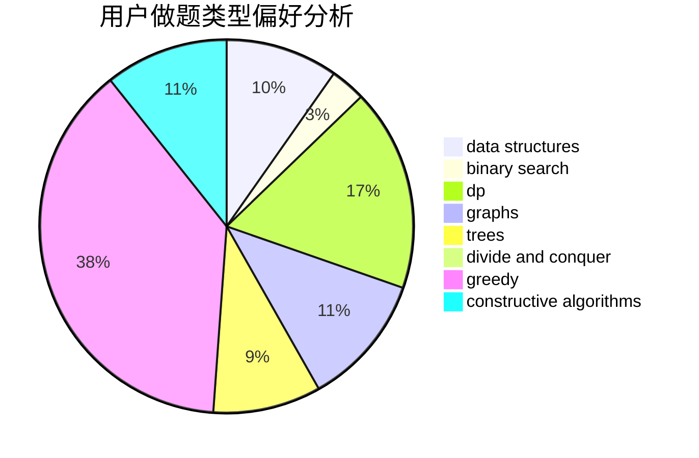
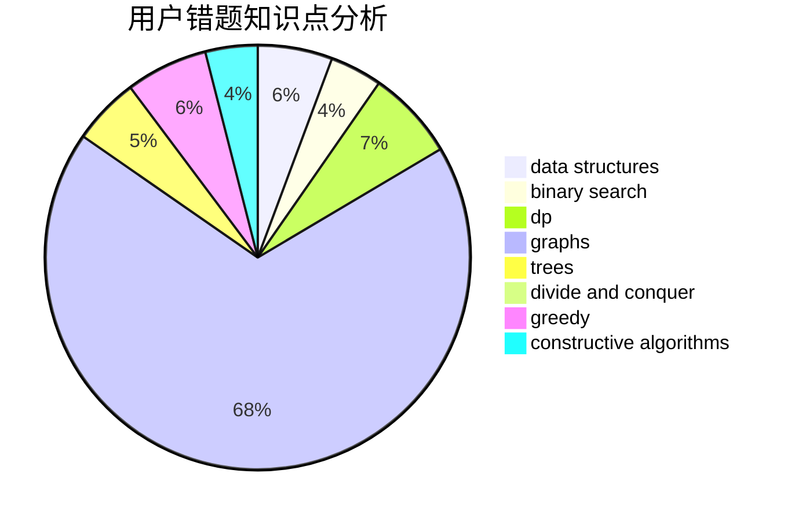

# zhangxiao
<!-- tabs:start -->
#### **用户提交结果分析**

#### **用户做题类型偏好分析**

#### **用户错题知识点分析**

<!-- tabs:end -->
# 推荐题目
[Cat Cycle](http://codeforces.com/problemset/problem/1487/B)		math,
                        number theory		  
[Strange Shuffle](http://codeforces.com/problemset/problem/1470/C)		binary search,
                        brute force,
                        constructive algorithms,
                        interactive		  
[Just Eat It!](http://codeforces.com/problemset/problem/1285/B)		dp,
                        greedy,
                        implementation		  
[Nikita and game](http://codeforces.com/problemset/problem/842/E)		binary search,
                        dfs and similar,
                        divide and conquer,
                        graphs,
                        trees		  
[Balance the Bits](https://codeforces.com/contest/1504/problem/C)		constructive algorithms,
                        greedy		  
[Kay and Snowflake](http://codeforces.com/problemset/problem/685/B)		data structures,
                        dfs and similar,
                        dp,
                        trees		  
[Dima and Lisa](http://codeforces.com/problemset/problem/584/D)		brute force,
                        math,
                        number theory		  
[Bear and Forgotten Tree 3](http://codeforces.com/problemset/problem/639/B)		constructive algorithms,
                        graphs,
                        trees		  
[New Year and Hurry](http://codeforces.com/problemset/problem/750/A)		binary search,
                        brute force,
                        implementation,
                        math		  
[Wrong Subtraction](http://codeforces.com/problemset/problem/977/A)		implementation		  
<!-- tabs:start -->
#### **data structures**
[Cat Cycle](http://codeforces.com/problemset/problem/685/B)		data structures,
                        dfs and similar,
                        dp,
                        trees		  
[Strange Shuffle](http://codeforces.com/problemset/problem/75/D)		data structures,
                        dp,
                        greedy,
                        implementation,
                        math,
                        trees		  
[Just Eat It!](http://codeforces.com/problemset/problem/1271/D)		data structures,
                        dp,
                        greedy,
                        implementation,
                        sortings		  
[Nikita and game](https://codeforces.com/contest/447/problem/E)		data structures,
                        math,
                        number theory		  
[Balance the Bits](https://codeforces.com/contest/759/problem/C)		data structures		  
[Kay and Snowflake](http://codeforces.com/problemset/problem/1359/F)		binary search,
                        brute force,
                        data structures,
                        geometry,
                        math		  
[Dima and Lisa](http://codeforces.com/problemset/problem/1455/G)		data structures,
                        dp		  
[Bear and Forgotten Tree 3](http://codeforces.com/problemset/problem/1512/D)		constructive algorithms,
                        data structures,
                        greedy		  
[New Year and Hurry](http://codeforces.com/problemset/problem/1249/D2)		data structures,
                        greedy,
                        sortings		  
[Wrong Subtraction](http://codeforces.com/problemset/problem/845/C)		data structures,
                        greedy,
                        sortings		  
#### **binary search**
[Cat Cycle](http://codeforces.com/problemset/problem/1470/C)		binary search,
                        brute force,
                        constructive algorithms,
                        interactive		  
[Strange Shuffle](http://codeforces.com/problemset/problem/842/E)		binary search,
                        dfs and similar,
                        divide and conquer,
                        graphs,
                        trees		  
[Just Eat It!](http://codeforces.com/problemset/problem/750/A)		binary search,
                        brute force,
                        implementation,
                        math		  
[Nikita and game](https://codeforces.com/contest/701/problem/D)		binary search,
                        math		  
[Balance the Bits](http://codeforces.com/problemset/problem/1359/F)		binary search,
                        brute force,
                        data structures,
                        geometry,
                        math		  
[Kay and Snowflake](http://codeforces.com/problemset/problem/1119/D)		binary search,
                        sortings		  
[Dima and Lisa](http://codeforces.com/problemset/problem/767/D)		binary search,
                        data structures,
                        greedy,
                        sortings,
                        two pointers		  
[Bear and Forgotten Tree 3](http://codeforces.com/problemset/problem/1470/A)		binary search,
                        dp,
                        greedy,
                        sortings,
                        two pointers		  
[New Year and Hurry](http://codeforces.com/problemset/problem/1419/D1)		binary search,
                        constructive algorithms,
                        greedy,
                        sortings		  
[Wrong Subtraction](http://codeforces.com/problemset/problem/1492/C)		binary search,
                        data structures,
                        dp,
                        greedy,
                        two pointers		  
#### **dp**
[Cat Cycle](http://codeforces.com/problemset/problem/1285/B)		dp,
                        greedy,
                        implementation		  
[Strange Shuffle](http://codeforces.com/problemset/problem/685/B)		data structures,
                        dfs and similar,
                        dp,
                        trees		  
[Just Eat It!](http://codeforces.com/problemset/problem/75/D)		data structures,
                        dp,
                        greedy,
                        implementation,
                        math,
                        trees		  
[Nikita and game](http://codeforces.com/problemset/problem/1109/D)		brute force,
                        combinatorics,
                        dp,
                        math,
                        trees		  
[Balance the Bits](https://codeforces.com/contest/418/problem/B)		bitmasks,
                        dp,
                        greedy,
                        sortings		  
[Kay and Snowflake](http://codeforces.com/problemset/problem/550/A)		brute force,
                        dp,
                        greedy,
                        implementation,
                        strings		  
[Dima and Lisa](http://codeforces.com/problemset/problem/1110/H)		dp,
                        strings		  
[Bear and Forgotten Tree 3](https://codeforces.com/contest/544/problem/C)		dp		  
[New Year and Hurry](http://codeforces.com/problemset/problem/1271/D)		data structures,
                        dp,
                        greedy,
                        implementation,
                        sortings		  
[Wrong Subtraction](http://codeforces.com/problemset/problem/1346/E)		*special problem,
                        dp,
                        graphs		  
#### **graph**
[Cat Cycle](http://codeforces.com/problemset/problem/842/E)		binary search,
                        dfs and similar,
                        divide and conquer,
                        graphs,
                        trees		  
[Strange Shuffle](http://codeforces.com/problemset/problem/639/B)		constructive algorithms,
                        graphs,
                        trees		  
[Just Eat It!](http://codeforces.com/problemset/problem/1346/E)		*special problem,
                        dp,
                        graphs		  
[Nikita and game](http://codeforces.com/problemset/problem/59/E)		graphs,
                        shortest paths		  
[Balance the Bits](https://codeforces.com/contest/781/problem/D)		bitmasks,
                        dp,
                        graphs,
                        matrices		  
[Kay and Snowflake](https://codeforces.com/contest/1020/problem/E)		constructive algorithms,
                        graphs		  
[Dima and Lisa](http://codeforces.com/problemset/problem/954/D)		dfs and similar,
                        graphs,
                        shortest paths		  
[Bear and Forgotten Tree 3](http://codeforces.com/problemset/problem/520/B)		dfs and similar,
                        graphs,
                        greedy,
                        implementation,
                        math,
                        shortest paths		  
[New Year and Hurry](http://codeforces.com/problemset/problem/1238/F)		dfs and similar,
                        dp,
                        graphs,
                        trees		  
[Wrong Subtraction](http://codeforces.com/problemset/problem/1487/C)		brute force,
                        constructive algorithms,
                        dfs and similar,
                        graphs,
                        greedy,
                        implementation,
                        math		  
#### **trees**
[Cat Cycle](http://codeforces.com/problemset/problem/842/E)		binary search,
                        dfs and similar,
                        divide and conquer,
                        graphs,
                        trees		  
[Strange Shuffle](http://codeforces.com/problemset/problem/685/B)		data structures,
                        dfs and similar,
                        dp,
                        trees		  
[Just Eat It!](http://codeforces.com/problemset/problem/639/B)		constructive algorithms,
                        graphs,
                        trees		  
[Nikita and game](http://codeforces.com/problemset/problem/75/D)		data structures,
                        dp,
                        greedy,
                        implementation,
                        math,
                        trees		  
[Balance the Bits](http://codeforces.com/problemset/problem/1109/D)		brute force,
                        combinatorics,
                        dp,
                        math,
                        trees		  
[Kay and Snowflake](http://codeforces.com/problemset/problem/455/B)		dfs and similar,
                        dp,
                        games,
                        implementation,
                        strings,
                        trees		  
[Dima and Lisa](http://codeforces.com/problemset/problem/1238/F)		dfs and similar,
                        dp,
                        graphs,
                        trees		  
[Bear and Forgotten Tree 3](http://codeforces.com/problemset/problem/1438/F)		interactive,
                        probabilities,
                        trees		  
[New Year and Hurry](http://codeforces.com/problemset/problem/1479/D)		binary search,
                        bitmasks,
                        brute force,
                        data structures,
                        probabilities,
                        trees		  
[Wrong Subtraction](http://codeforces.com/problemset/problem/1511/C)		brute force,
                        data structures,
                        implementation,
                        trees		  
#### **divide and conquer**
[Cat Cycle](http://codeforces.com/problemset/problem/842/E)		binary search,
                        dfs and similar,
                        divide and conquer,
                        graphs,
                        trees		  
[Strange Shuffle](http://codeforces.com/problemset/problem/888/E)		bitmasks,
                        divide and conquer,
                        meet-in-the-middle		  
[Just Eat It!](http://codeforces.com/problemset/problem/1461/D)		binary search,
                        brute force,
                        data structures,
                        divide and conquer,
                        implementation,
                        sortings		  
[Nikita and game](http://codeforces.com/problemset/problem/1466/G)		combinatorics,
                        divide and conquer,
                        hashing,
                        math,
                        string suffix structures,
                        strings		  
[Balance the Bits](http://codeforces.com/problemset/problem/1490/D)		dfs and similar,
                        divide and conquer,
                        implementation		  
[Kay and Snowflake](https://codeforces.com/contest/1483/problem/C)		data structures,
                        divide and conquer,
                        dp		  
[Dima and Lisa](http://codeforces.com/problemset/problem/1491/E)		brute force,
                        dfs and similar,
                        divide and conquer,
                        number theory,
                        trees		  
[Bear and Forgotten Tree 3](http://codeforces.com/problemset/problem/1303/G)		data structures,
                        divide and conquer,
                        geometry,
                        trees		  
[New Year and Hurry](http://codeforces.com/problemset/problem/1494/D)		constructive algorithms,
                        data structures,
                        dfs and similar,
                        divide and conquer,
                        dsu,
                        greedy,
                        sortings,
                        trees		  
[Wrong Subtraction](http://codeforces.com/problemset/problem/1482/E)		data structures,
                        divide and conquer,
                        dp		  
#### **greedy**
[Cat Cycle](http://codeforces.com/problemset/problem/1285/B)		dp,
                        greedy,
                        implementation		  
[Strange Shuffle](https://codeforces.com/contest/1504/problem/C)		constructive algorithms,
                        greedy		  
[Just Eat It!](http://codeforces.com/problemset/problem/75/D)		data structures,
                        dp,
                        greedy,
                        implementation,
                        math,
                        trees		  
[Nikita and game](https://codeforces.com/contest/418/problem/B)		bitmasks,
                        dp,
                        greedy,
                        sortings		  
[Balance the Bits](http://codeforces.com/problemset/problem/550/A)		brute force,
                        dp,
                        greedy,
                        implementation,
                        strings		  
[Kay and Snowflake](http://codeforces.com/problemset/problem/1346/B)		*special problem,
                        greedy		  
[Dima and Lisa](http://codeforces.com/problemset/problem/870/B)		greedy		  
[Bear and Forgotten Tree 3](https://codeforces.com/contest/820/problem/C)		games,
                        greedy		  
[New Year and Hurry](http://codeforces.com/problemset/problem/1271/D)		data structures,
                        dp,
                        greedy,
                        implementation,
                        sortings		  
[Wrong Subtraction](http://codeforces.com/problemset/problem/1062/C)		greedy,
                        implementation,
                        math		  
#### **constructive algorithms**
[Cat Cycle](http://codeforces.com/problemset/problem/1470/C)		binary search,
                        brute force,
                        constructive algorithms,
                        interactive		  
[Strange Shuffle](https://codeforces.com/contest/1504/problem/C)		constructive algorithms,
                        greedy		  
[Just Eat It!](http://codeforces.com/problemset/problem/639/B)		constructive algorithms,
                        graphs,
                        trees		  
[Nikita and game](https://codeforces.com/contest/1020/problem/E)		constructive algorithms,
                        graphs		  
[Balance the Bits](http://codeforces.com/problemset/problem/1100/D)		constructive algorithms,
                        games,
                        interactive		  
[Kay and Snowflake](http://codeforces.com/problemset/problem/1373/E)		brute force,
                        constructive algorithms,
                        dp,
                        greedy		  
[Dima and Lisa](http://codeforces.com/problemset/problem/1313/B)		constructive algorithms,
                        greedy,
                        implementation,
                        math		  
[Bear and Forgotten Tree 3](http://codeforces.com/problemset/problem/1512/D)		constructive algorithms,
                        data structures,
                        greedy		  
[New Year and Hurry](http://codeforces.com/problemset/problem/676/A)		constructive algorithms,
                        implementation		  
[Wrong Subtraction](https://codeforces.com/contest/1243/problem/C)		constructive algorithms,
                        math,
                        number theory		  
#### **sortings**
[Cat Cycle](https://codeforces.com/contest/418/problem/B)		bitmasks,
                        dp,
                        greedy,
                        sortings		  
[Strange Shuffle](http://codeforces.com/problemset/problem/1271/D)		data structures,
                        dp,
                        greedy,
                        implementation,
                        sortings		  
[Just Eat It!](http://codeforces.com/problemset/problem/559/E)		dp,
                        sortings		  
[Nikita and game](http://codeforces.com/problemset/problem/1102/B)		greedy,
                        sortings		  
[Balance the Bits](http://codeforces.com/problemset/problem/379/C)		greedy,
                        sortings		  
[Kay and Snowflake](http://codeforces.com/problemset/problem/1119/D)		binary search,
                        sortings		  
[Dima and Lisa](http://codeforces.com/problemset/problem/1249/D2)		data structures,
                        greedy,
                        sortings		  
[Bear and Forgotten Tree 3](http://codeforces.com/problemset/problem/845/C)		data structures,
                        greedy,
                        sortings		  
[New Year and Hurry](http://codeforces.com/problemset/problem/767/D)		binary search,
                        data structures,
                        greedy,
                        sortings,
                        two pointers		  
[Wrong Subtraction](http://codeforces.com/problemset/problem/1470/A)		binary search,
                        dp,
                        greedy,
                        sortings,
                        two pointers		  
<!-- tabs:end -->
