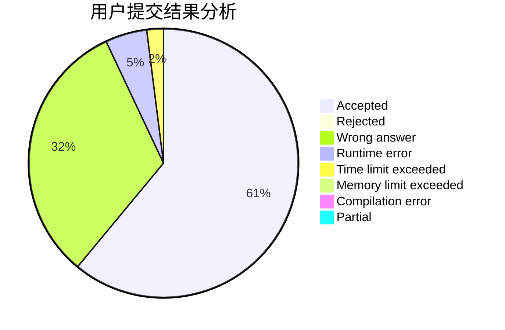
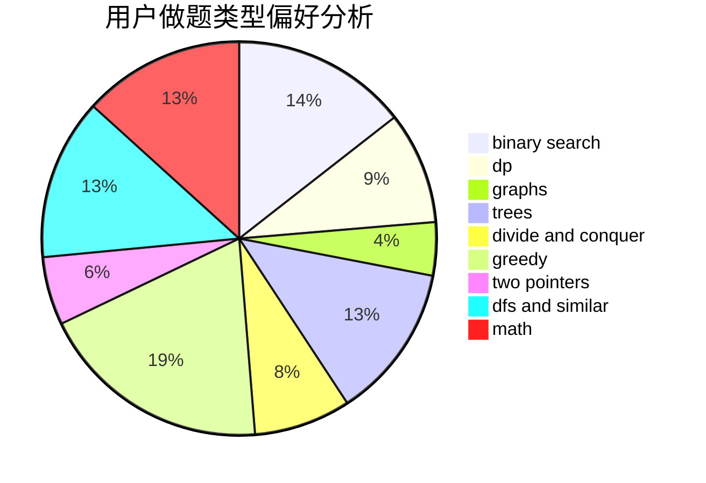

# zhangyekai

<!-- tabs:start -->

#### **用户提交结果分析**

#### **用户做题类型偏好分析**

<!-- tabs:end -->
# 推荐题目
[1164M](https://codeforces.com/contest/1164/problem/M)
[1294F](https://codeforces.com/contest/1294/problem/F)
[506A](https://codeforces.com/contest/506/problem/A)
[733D](https://codeforces.com/contest/733/problem/D)
[1241B](https://codeforces.com/contest/1241/problem/B)
[990A](https://codeforces.com/contest/990/problem/A)
[1139D](https://codeforces.com/contest/1139/problem/D)
[837G](https://codeforces.com/contest/837/problem/G)
[833B](https://codeforces.com/contest/833/problem/B)
[799E](https://codeforces.com/contest/799/problem/E)
