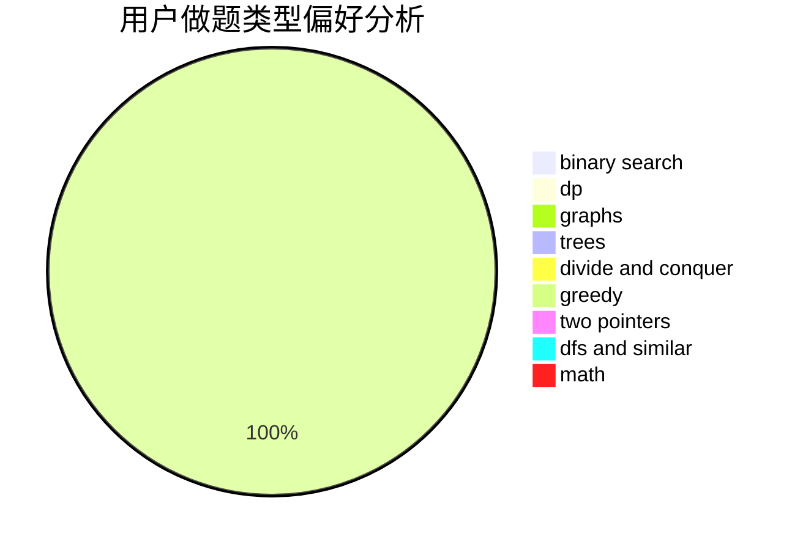

# ChenXuanYu

<!-- tabs:start -->

#### **用户提交结果分析**

#### **用户做题类型偏好分析**

<!-- tabs:end -->
# 推荐题目
[1432E](https://codeforces.com/contest/1432/problem/E)
[6902](https://codeforces.com/contest/690/problem/2)
[1490C](https://codeforces.com/contest/1490/problem/C)
[1497B](https://codeforces.com/contest/1497/problem/B)
[1491C](https://codeforces.com/contest/1491/problem/C)
[1484C](https://codeforces.com/contest/1484/problem/C)
[1480A](https://codeforces.com/contest/1480/problem/A)
[1513C](https://codeforces.com/contest/1513/problem/C)
[1487B](https://codeforces.com/contest/1487/problem/B)
[1498C](https://codeforces.com/contest/1498/problem/C)
