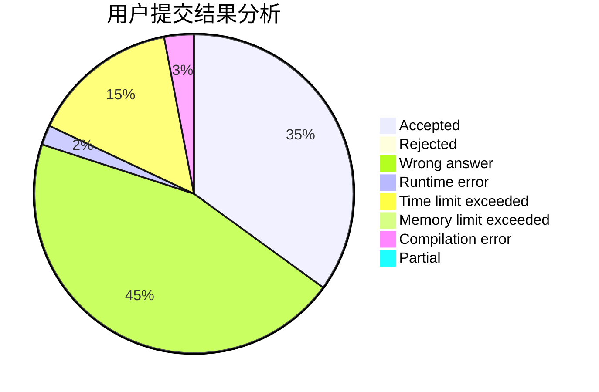
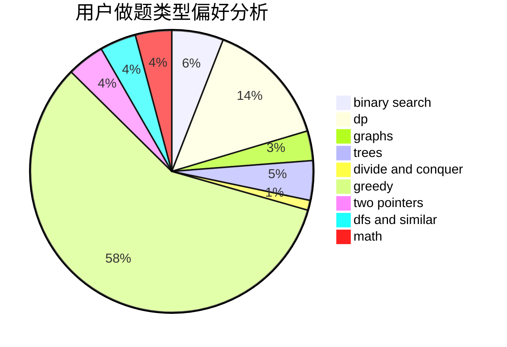

# zhangzx123

<!-- tabs:start -->

#### **用户提交结果分析**

#### **用户做题类型偏好分析**

<!-- tabs:end -->
# 推荐题目
[682D](https://codeforces.com/contest/682/problem/D)
[7A](https://codeforces.com/contest/7/problem/A)
[1083F](https://codeforces.com/contest/1083/problem/F)
[1114C](https://codeforces.com/contest/1114/problem/C)
[1101G](https://codeforces.com/contest/1101/problem/G)
[357B](https://codeforces.com/contest/357/problem/B)
[402D](https://codeforces.com/contest/402/problem/D)
[901B](https://codeforces.com/contest/901/problem/B)
[515D](https://codeforces.com/contest/515/problem/D)
[665D](https://codeforces.com/contest/665/problem/D)
