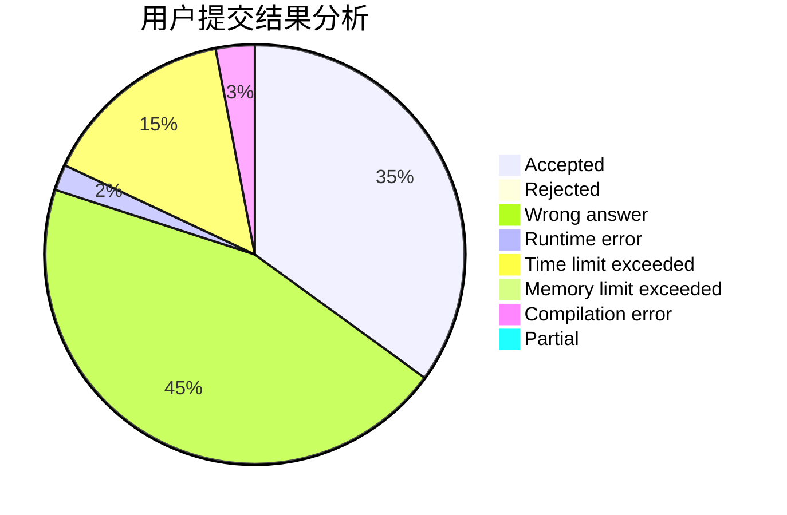
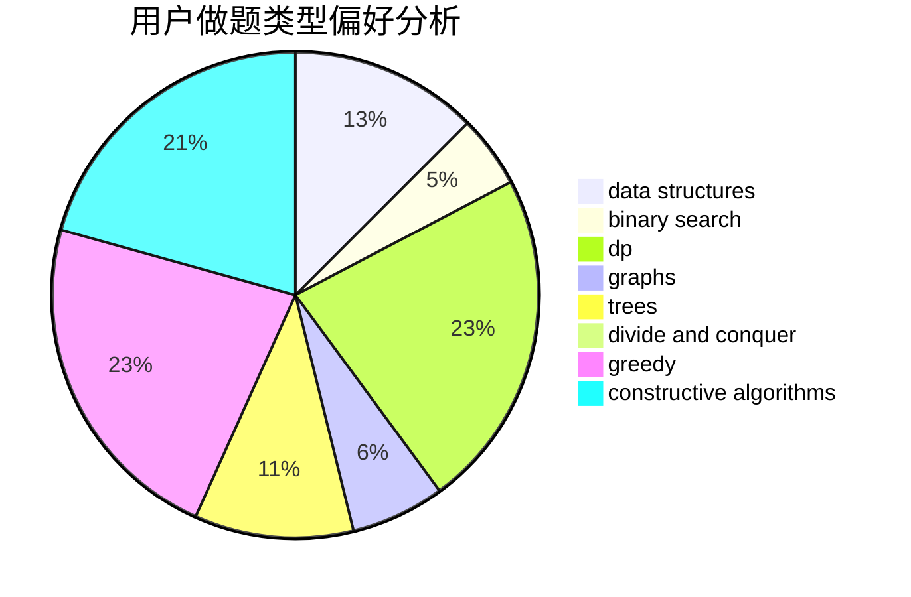
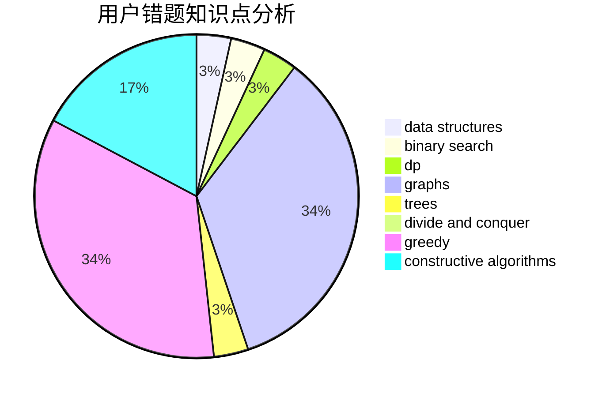

# zhangzx123

<!-- tabs:start -->

#### **用户提交结果分析**

#### **用户做题类型偏好分析**

#### **用户错题知识点分析**

<!-- tabs:end -->
# 推荐题目
[682D](https://codeforces.com/contest/682/problem/D)		dp,
                        strings		  
[7A](https://codeforces.com/contest/7/problem/A)		brute force,
                        constructive algorithms		  
[1083F](https://codeforces.com/contest/1083/problem/F)		data structures		  
[1114C](https://codeforces.com/contest/1114/problem/C)		brute force,
                        implementation,
                        math,
                        number theory		  
[1101G](https://codeforces.com/contest/1101/problem/G)		math,
                        matrices		  
[357B](https://codeforces.com/contest/357/problem/B)		constructive algorithms,
                        implementation		  
[402D](https://codeforces.com/contest/402/problem/D)		dp,
                        greedy,
                        math,
                        number theory		  
[901B](https://codeforces.com/contest/901/problem/B)		constructive algorithms,
                        math		  
[515D](https://codeforces.com/contest/515/problem/D)		constructive algorithms,
                        greedy		  
[665D](https://codeforces.com/contest/665/problem/D)		constructive algorithms,
                        greedy,
                        number theory		  
