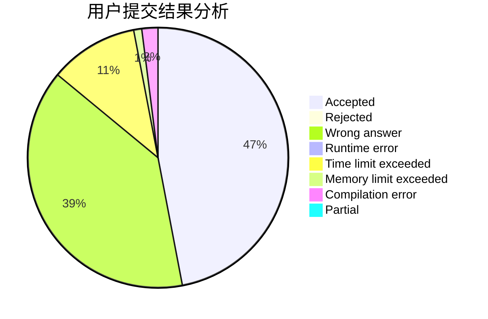
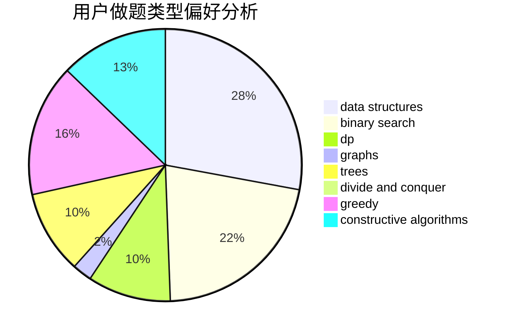
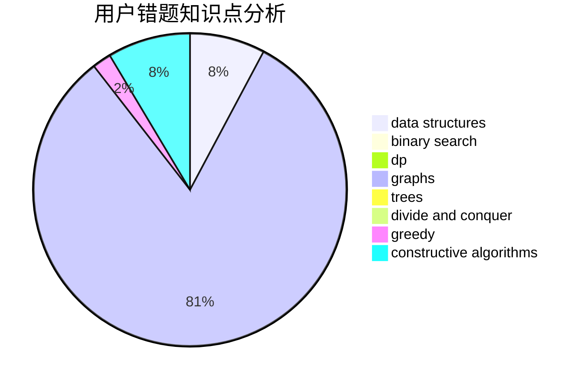

# zhangzy

<!-- tabs:start -->

#### **用户提交结果分析**

#### **用户做题类型偏好分析**

#### **用户错题知识点分析**

<!-- tabs:end -->
# 推荐题目
[667A](https://codeforces.com/contest/667/problem/A)		geometry,
                        math		  
[1168C](https://codeforces.com/contest/1168/problem/C)		bitmasks,
                        dp		  
[79D](https://codeforces.com/contest/79/problem/D)		bitmasks,
                        dp,
                        shortest paths		  
[235C](https://codeforces.com/contest/235/problem/C)		data structures,
                        string suffix structures,
                        strings		  
[264D](https://codeforces.com/contest/264/problem/D)		dp,
                        two pointers		  
[799D](https://codeforces.com/contest/799/problem/D)		brute force,
                        dp,
                        meet-in-the-middle		  
[581C](https://codeforces.com/contest/581/problem/C)		implementation,
                        math,
                        sortings		  
[1313A](https://codeforces.com/contest/1313/problem/A)		brute force,
                        greedy,
                        implementation		  
[623C](https://codeforces.com/contest/623/problem/C)		binary search,
                        dp		  
[2C](https://codeforces.com/contest/2/problem/C)		geometry		  
