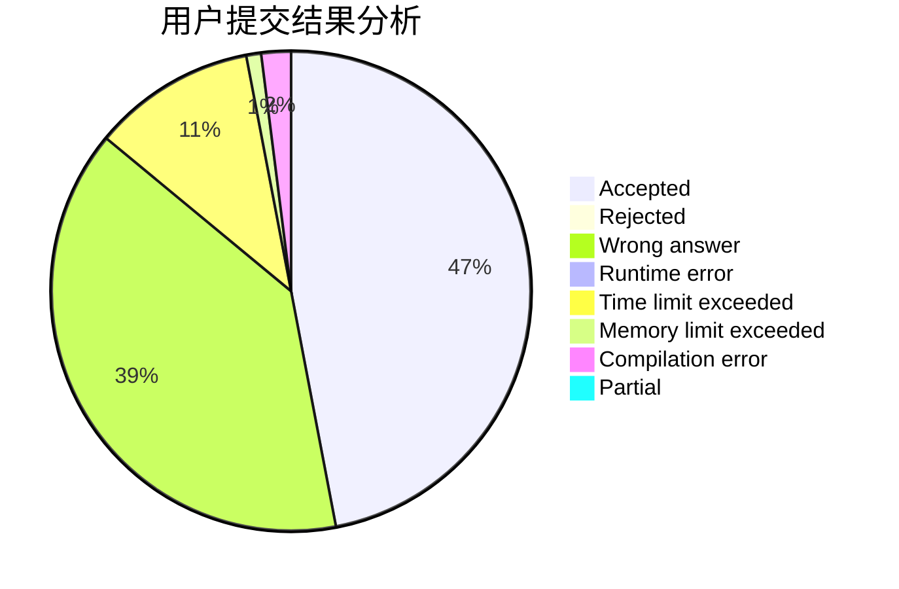
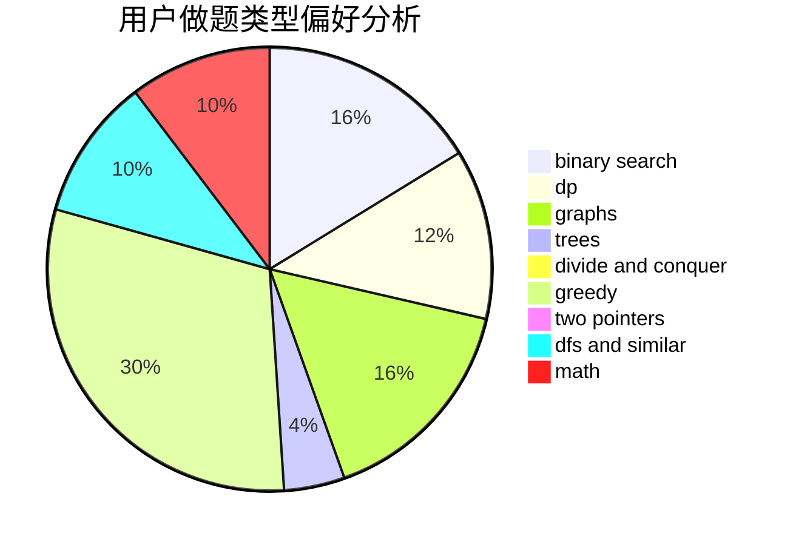

# zhangzy

<!-- tabs:start -->

#### **用户提交结果分析**

#### **用户做题类型偏好分析**

<!-- tabs:end -->
# 推荐题目
[689A](https://codeforces.com/contest/689/problem/A)
[11732](https://codeforces.com/contest/1173/problem/2)
[814A](https://codeforces.com/contest/814/problem/A)
[258B](https://codeforces.com/contest/258/problem/B)
[280D](https://codeforces.com/contest/280/problem/D)
[813D](https://codeforces.com/contest/813/problem/D)
[601D](https://codeforces.com/contest/601/problem/D)
[1322D](https://codeforces.com/contest/1322/problem/D)
[651C](https://codeforces.com/contest/651/problem/C)
[318B](https://codeforces.com/contest/318/problem/B)
