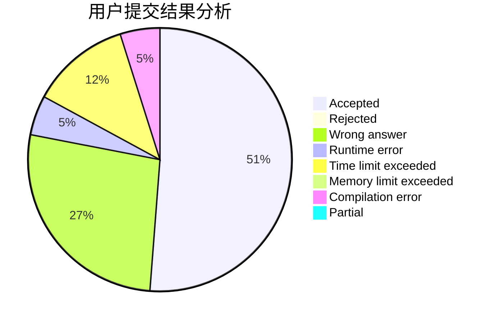
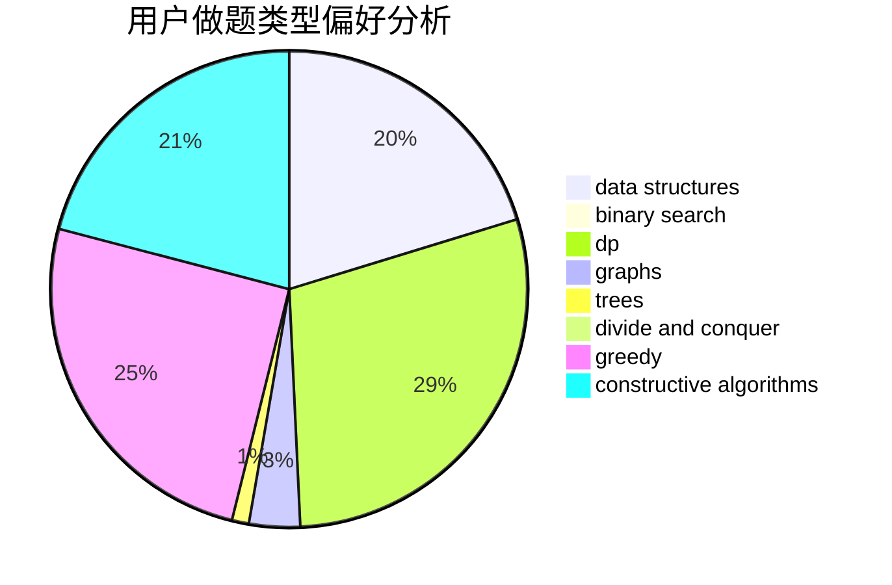
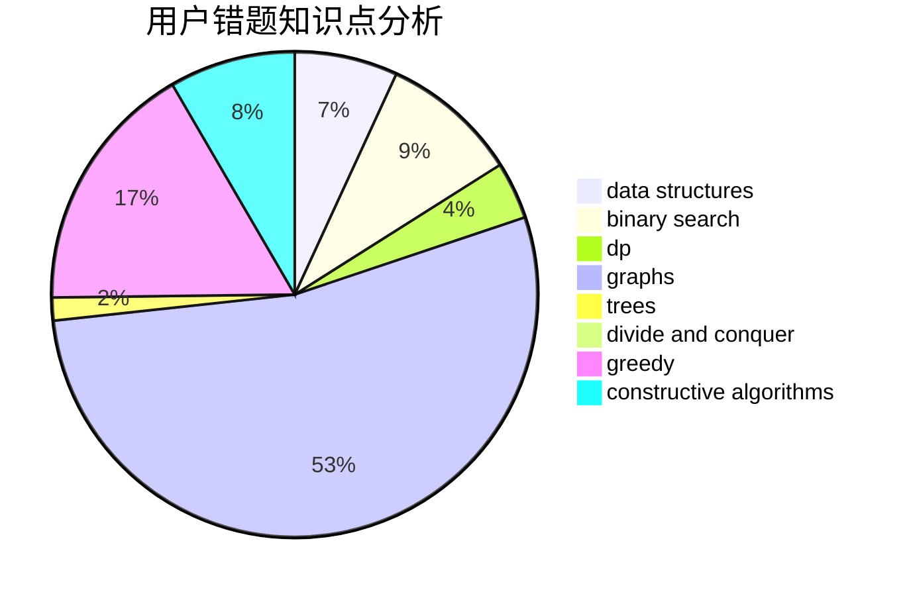

# zhaojunhao

<!-- tabs:start -->

#### **用户提交结果分析**

#### **用户做题类型偏好分析**

#### **用户错题知识点分析**

<!-- tabs:end -->
# 推荐题目
[160A](https://codeforces.com/contest/160/problem/A)		greedy,
                        sortings		  
[578F](https://codeforces.com/contest/578/problem/F)		matrices,
                        trees		  
[1089E](https://codeforces.com/contest/1089/problem/E)		constructive algorithms		  
[1380E](https://codeforces.com/contest/1380/problem/E)		data structures,
                        dsu,
                        implementation,
                        trees		  
[452B](https://codeforces.com/contest/452/problem/B)		brute force,
                        constructive algorithms,
                        geometry,
                        trees		  
[1252A](https://codeforces.com/contest/1252/problem/A)		nan		  
[923A](https://codeforces.com/contest/923/problem/A)		math,
                        number theory		  
[1118E](https://codeforces.com/contest/1118/problem/E)		constructive algorithms,
                        implementation		  
[798E](https://codeforces.com/contest/798/problem/E)		constructive algorithms,
                        data structures,
                        graphs,
                        sortings		  
[441E](https://codeforces.com/contest/441/problem/E)		bitmasks,
                        dp,
                        math,
                        probabilities		  
