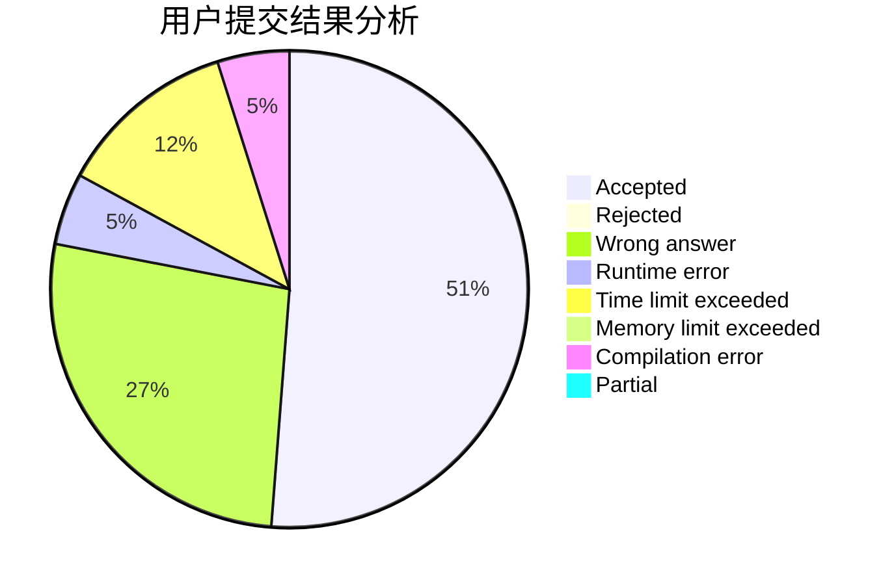
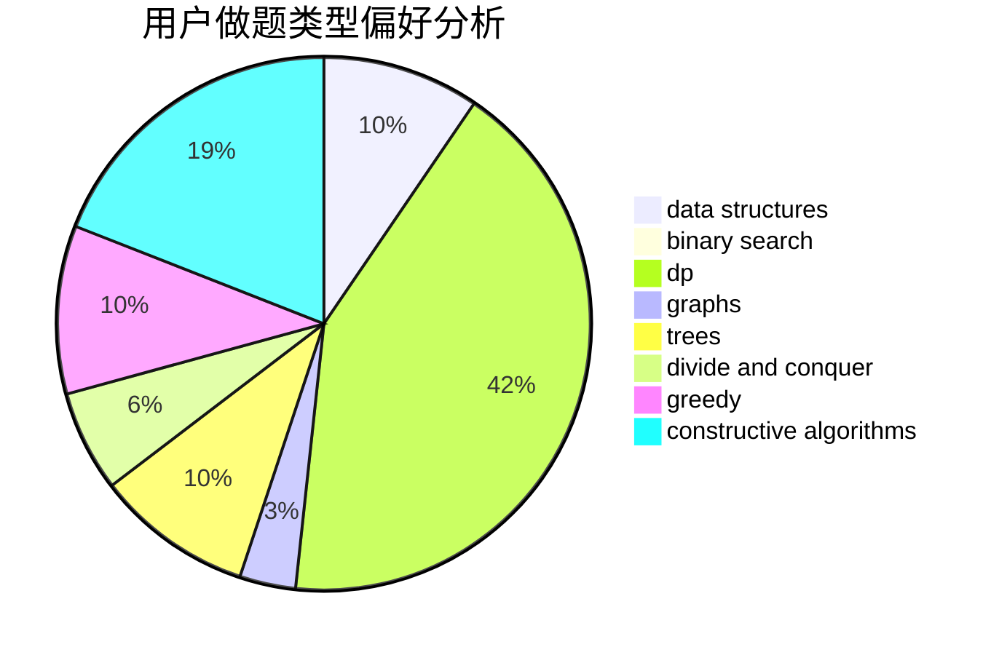
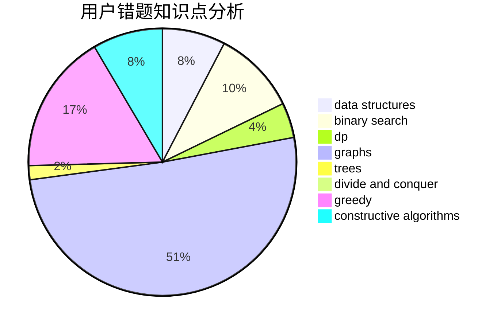

# zhaojunhao

<!-- tabs:start -->

#### **用户提交结果分析**

#### **用户做题类型偏好分析**

#### **用户错题知识点分析**

<!-- tabs:end -->
# 推荐题目
[183D](https://codeforces.com/contest/183/problem/D)		dp,
                        greedy,
                        probabilities		  
[59E](https://codeforces.com/contest/59/problem/E)		graphs,
                        shortest paths		  
[1089I](https://codeforces.com/contest/1089/problem/I)		nan		  
[138C](https://codeforces.com/contest/138/problem/C)		binary search,
                        data structures,
                        probabilities,
                        sortings		  
[474B](https://codeforces.com/contest/474/problem/B)		binary search,
                        implementation		  
[1257C](https://codeforces.com/contest/1257/problem/C)		greedy,
                        implementation,
                        sortings,
                        strings,
                        two pointers		  
[946F](https://codeforces.com/contest/946/problem/F)		combinatorics,
                        dp,
                        matrices		  
[1120C](https://codeforces.com/contest/1120/problem/C)		dp,
                        strings		  
[813A](https://codeforces.com/contest/813/problem/A)		implementation		  
[462C](https://codeforces.com/contest/462/problem/C)		dsu,graphs,sortings,trees		  
