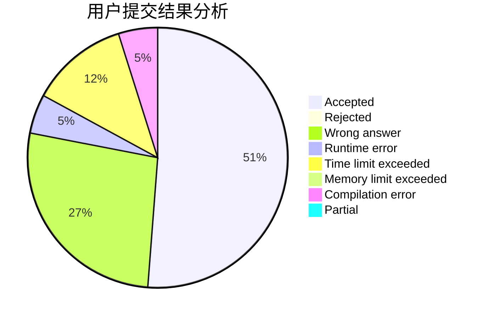
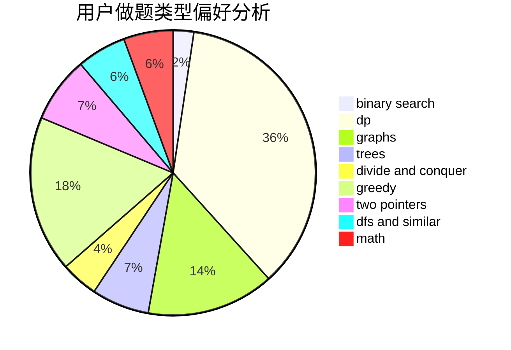

# zhaojunhao

<!-- tabs:start -->

#### **用户提交结果分析**

#### **用户做题类型偏好分析**

<!-- tabs:end -->
# 推荐题目
[183D](https://codeforces.com/contest/183/problem/D)
[59E](https://codeforces.com/contest/59/problem/E)
[1089I](https://codeforces.com/contest/1089/problem/I)
[138C](https://codeforces.com/contest/138/problem/C)
[474B](https://codeforces.com/contest/474/problem/B)
[1257C](https://codeforces.com/contest/1257/problem/C)
[946F](https://codeforces.com/contest/946/problem/F)
[1120C](https://codeforces.com/contest/1120/problem/C)
[813A](https://codeforces.com/contest/813/problem/A)
[462C](https://codeforces.com/contest/462/problem/C)
