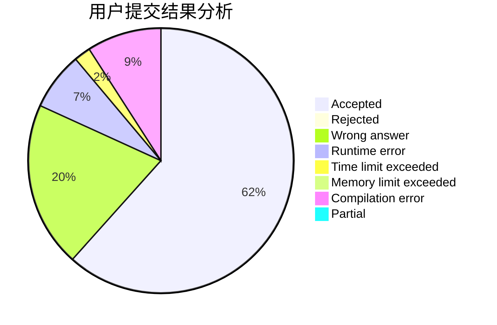
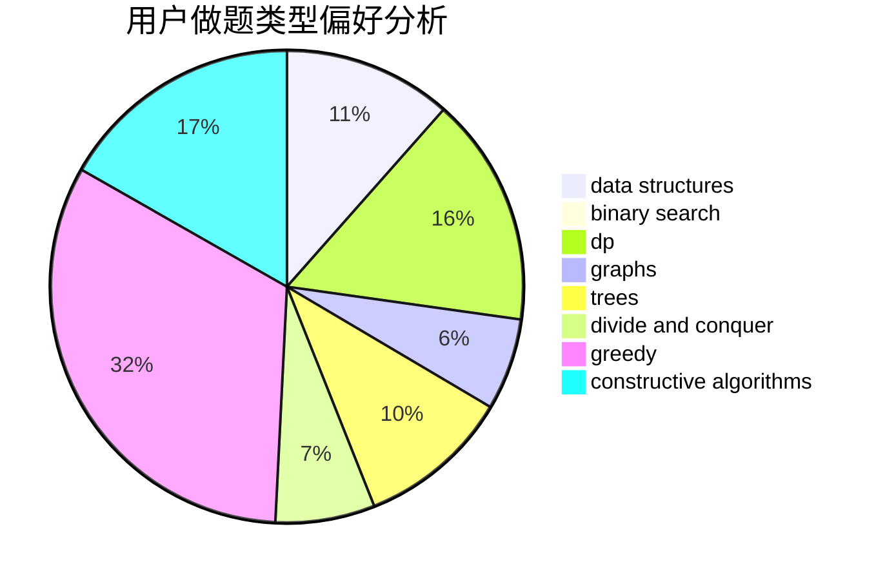

# zhaoluo

<!-- tabs:start -->

#### **用户提交结果分析**

#### **用户做题类型偏好分析**

#### **用户错题知识点分析**

<!-- tabs:end -->
# 推荐题目
[1139D](https://codeforces.com/contest/1139/problem/D)		dp,
                        math,
                        number theory,
                        probabilities		  
[996E](https://codeforces.com/contest/996/problem/E)		dsu,graphs,sortings,trees		  
[1236B](https://codeforces.com/contest/1236/problem/B)		combinatorics,
                        math		  
[771D](https://codeforces.com/contest/771/problem/D)		dp		  
[273D](https://codeforces.com/contest/273/problem/D)		dp		  
[1089A](https://codeforces.com/contest/1089/problem/A)		dp		  
[935F](https://codeforces.com/contest/935/problem/F)		data structures,
                        greedy		  
[622A](https://codeforces.com/contest/622/problem/A)		implementation,
                        math		  
[1244G](https://codeforces.com/contest/1244/problem/G)		constructive algorithms,
                        greedy,
                        math		  
[849A](https://codeforces.com/contest/849/problem/A)		implementation		  
