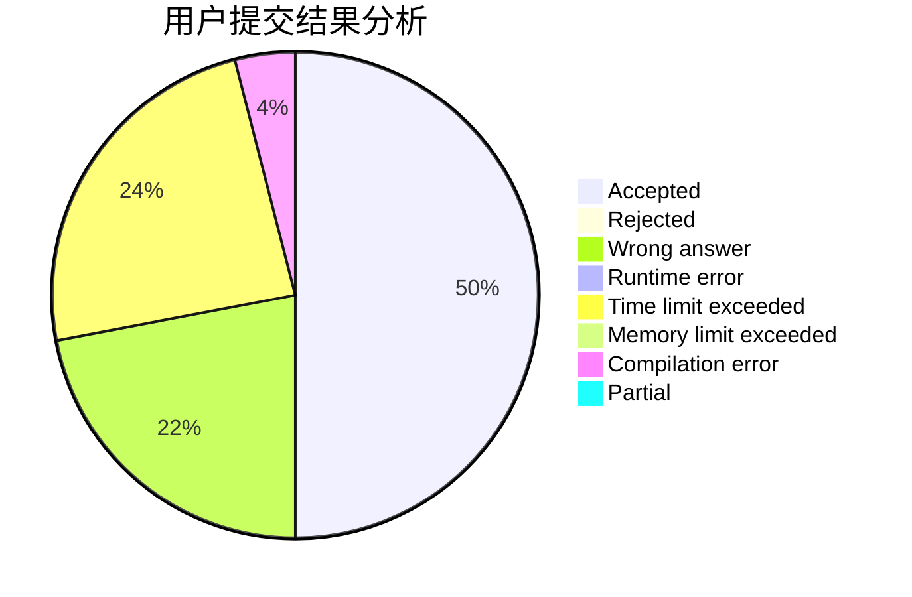
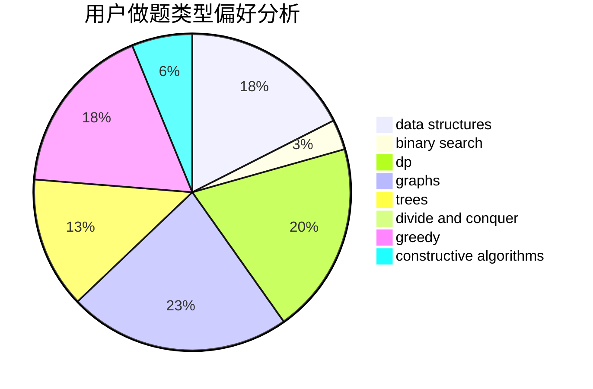
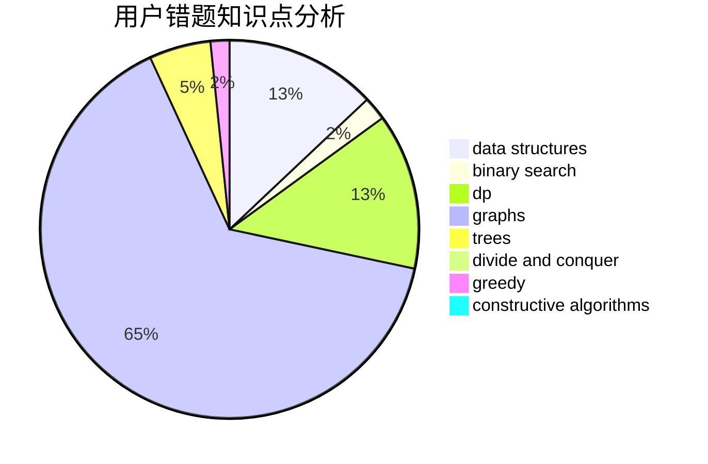

# zhaorunhao

<!-- tabs:start -->

#### **用户提交结果分析**

#### **用户做题类型偏好分析**

#### **用户错题知识点分析**

<!-- tabs:end -->
# 推荐题目
[1111C](https://codeforces.com/contest/1111/problem/C)		binary search,
                        brute force,
                        divide and conquer,
                        math		  
[768A](https://codeforces.com/contest/768/problem/A)		constructive algorithms,
                        sortings		  
[1209H](https://codeforces.com/contest/1209/problem/H)		data structures,
                        greedy,
                        math		  
[981D](https://codeforces.com/contest/981/problem/D)		bitmasks,
                        dp,
                        greedy		  
[601B](https://codeforces.com/contest/601/problem/B)		data structures,
                        math		  
[478D](https://codeforces.com/contest/478/problem/D)		dp		  
[955C](https://codeforces.com/contest/955/problem/C)		binary search,
                        math,
                        number theory		  
[827C](https://codeforces.com/contest/827/problem/C)		data structures,
                        strings		  
[613E](https://codeforces.com/contest/613/problem/E)		dp,
                        hashing,
                        strings		  
[304C](https://codeforces.com/contest/304/problem/C)		dsu,graphs,sortings,trees		  
