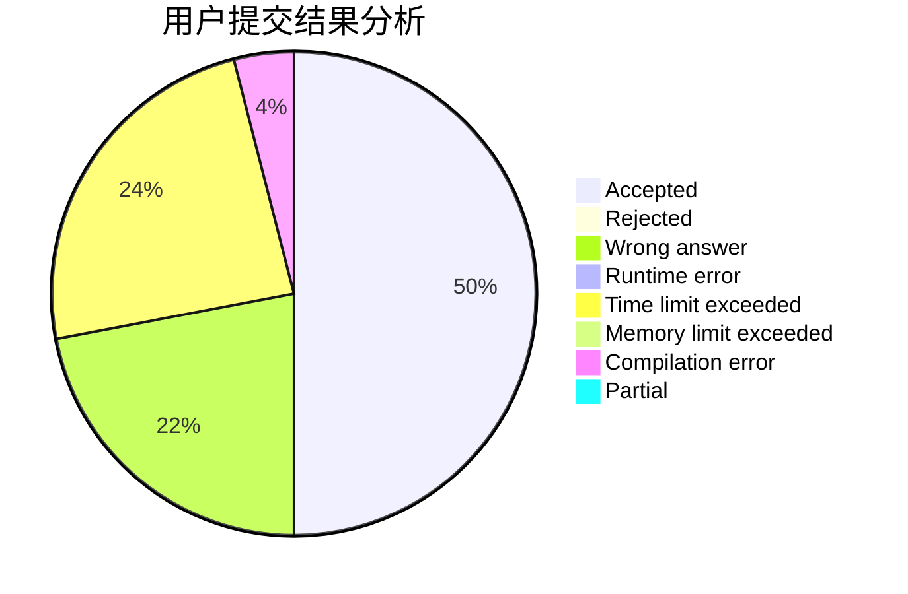
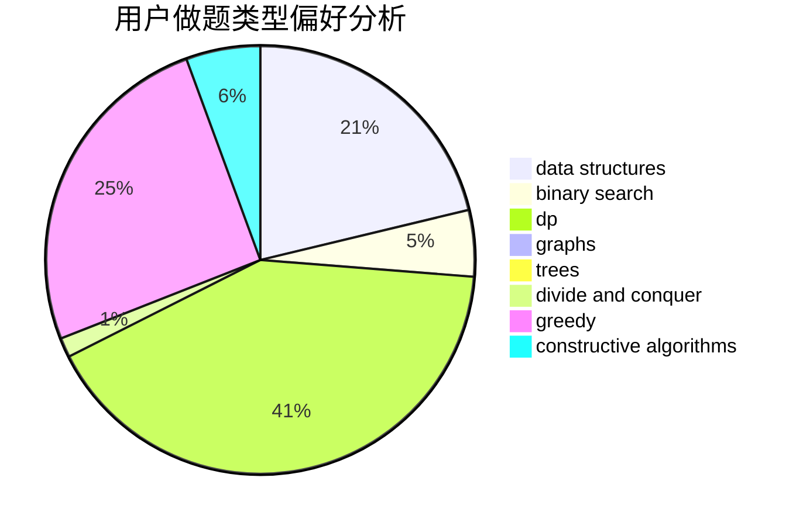
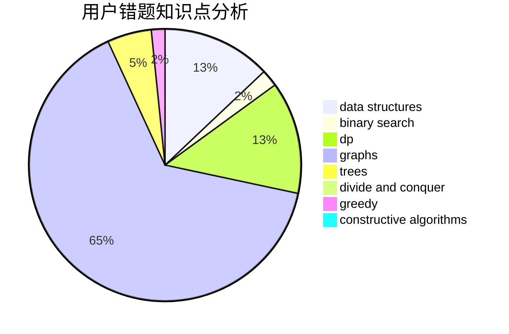

# zhaorunhao

<!-- tabs:start -->

#### **用户提交结果分析**

#### **用户做题类型偏好分析**

#### **用户错题知识点分析**

<!-- tabs:end -->
# 推荐题目
[1110H](https://codeforces.com/contest/1110/problem/H)		dp,
                        strings		  
[749A](https://codeforces.com/contest/749/problem/A)		greedy,
                        implementation,
                        math,
                        number theory		  
[1205D](https://codeforces.com/contest/1205/problem/D)		constructive algorithms,
                        trees		  
[959F](https://codeforces.com/contest/959/problem/F)		bitmasks,
                        dp,
                        math,
                        matrices		  
[581A](https://codeforces.com/contest/581/problem/A)		implementation,
                        math		  
[459E](https://codeforces.com/contest/459/problem/E)		dp,
                        sortings		  
[933C](https://codeforces.com/contest/933/problem/C)		geometry,
                        graphs		  
[809D](https://codeforces.com/contest/809/problem/D)		data structures,
                        dp		  
[597A](https://codeforces.com/contest/597/problem/A)		math		  
[28C](https://codeforces.com/contest/28/problem/C)		combinatorics,
                        dp,
                        probabilities		  
