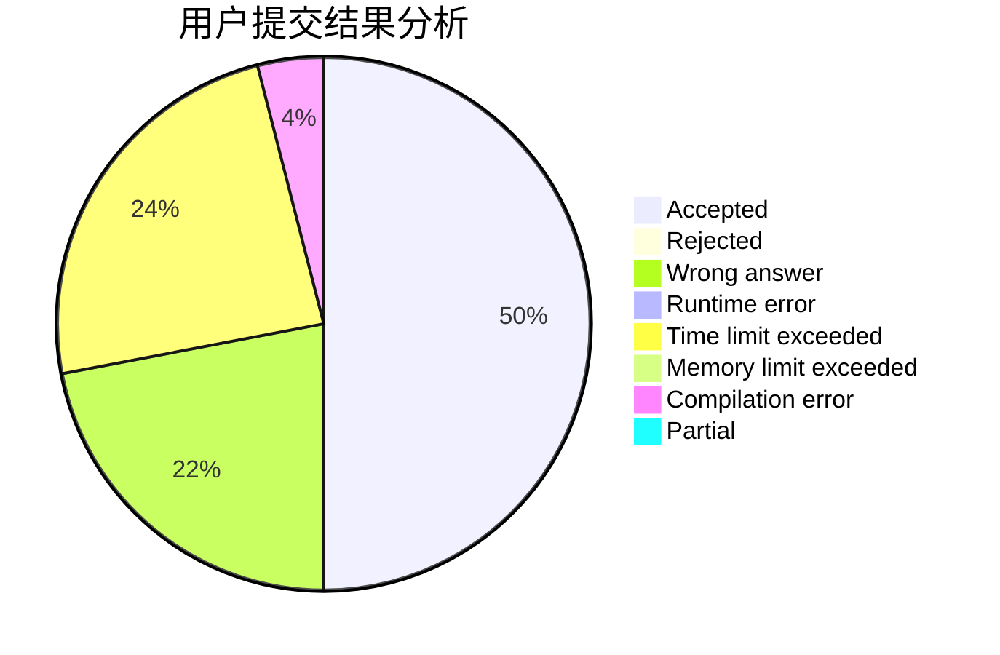
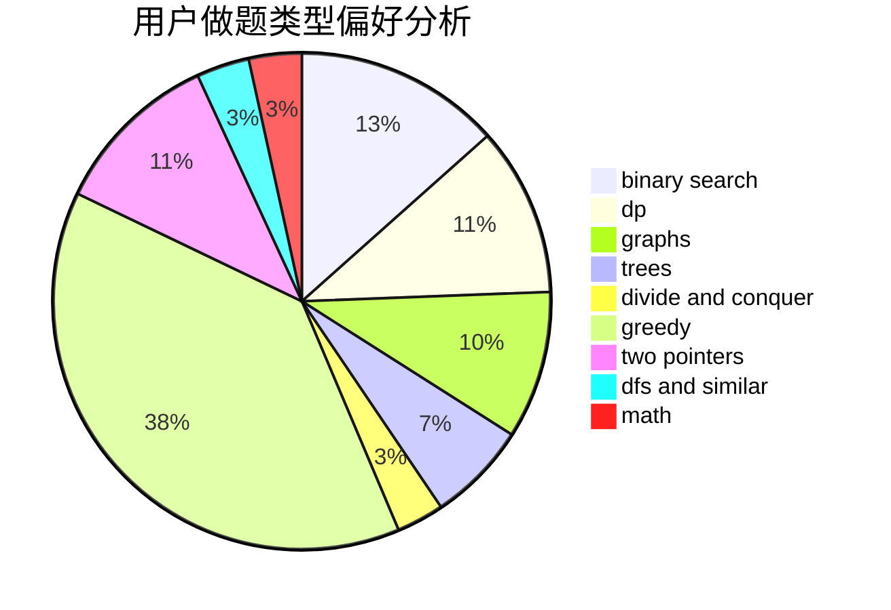

# zhaorunhao

<!-- tabs:start -->

#### **用户提交结果分析**

#### **用户做题类型偏好分析**

<!-- tabs:end -->
# 推荐题目
[1111C](https://codeforces.com/contest/1111/problem/C)
[768A](https://codeforces.com/contest/768/problem/A)
[1209H](https://codeforces.com/contest/1209/problem/H)
[981D](https://codeforces.com/contest/981/problem/D)
[601B](https://codeforces.com/contest/601/problem/B)
[478D](https://codeforces.com/contest/478/problem/D)
[955C](https://codeforces.com/contest/955/problem/C)
[827C](https://codeforces.com/contest/827/problem/C)
[613E](https://codeforces.com/contest/613/problem/E)
[304C](https://codeforces.com/contest/304/problem/C)
