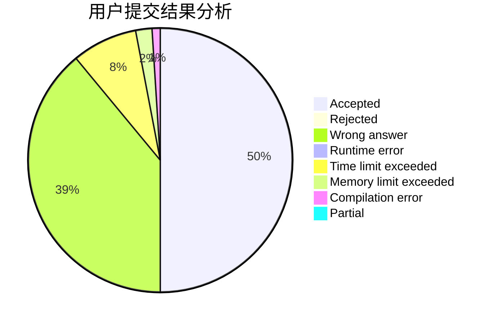
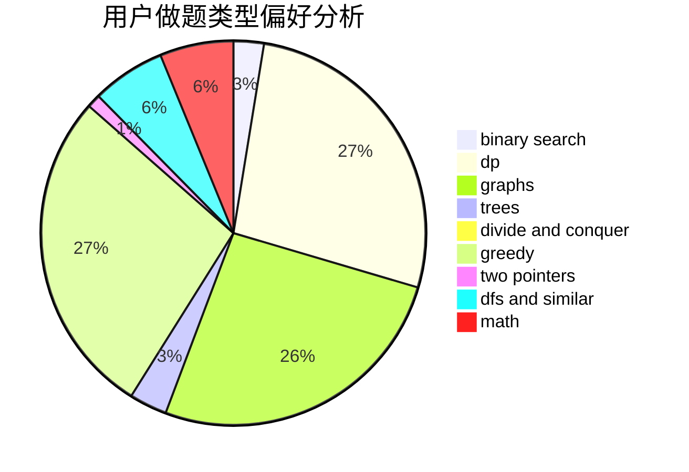

# zhenGG

<!-- tabs:start -->

#### **用户提交结果分析**

#### **用户做题类型偏好分析**

<!-- tabs:end -->
# 推荐题目
[603E](https://codeforces.com/contest/603/problem/E)
[720D](https://codeforces.com/contest/720/problem/D)
[743E](https://codeforces.com/contest/743/problem/E)
[1101C](https://codeforces.com/contest/1101/problem/C)
[883M](https://codeforces.com/contest/883/problem/M)
[540C](https://codeforces.com/contest/540/problem/C)
[126B](https://codeforces.com/contest/126/problem/B)
[685B](https://codeforces.com/contest/685/problem/B)
[484D](https://codeforces.com/contest/484/problem/D)
[1013D](https://codeforces.com/contest/1013/problem/D)
