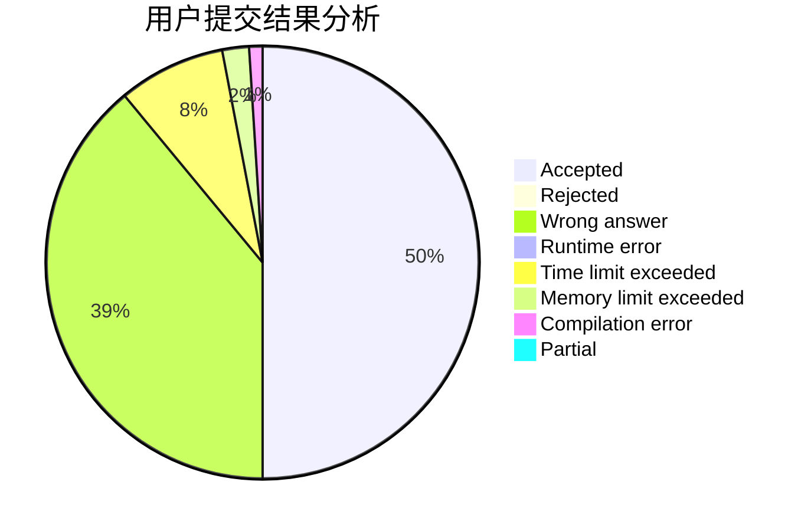
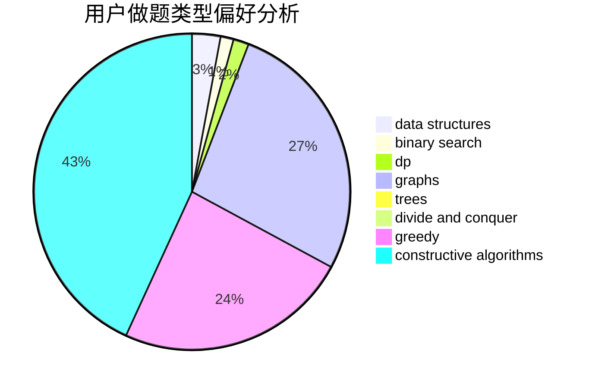
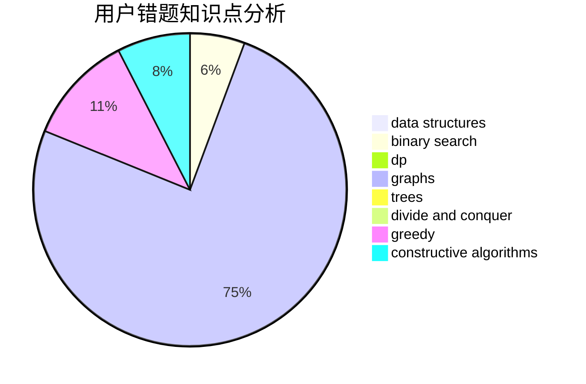

# zhenGG

<!-- tabs:start -->

#### **用户提交结果分析**

#### **用户做题类型偏好分析**

#### **用户错题知识点分析**

<!-- tabs:end -->
# 推荐题目
[603E](https://codeforces.com/contest/603/problem/E)		data structures,
                        divide and conquer,
                        dsu,
                        math,
                        trees		  
[720D](https://codeforces.com/contest/720/problem/D)		data structures,
                        dp,
                        sortings		  
[743E](https://codeforces.com/contest/743/problem/E)		binary search,
                        bitmasks,
                        brute force,
                        dp		  
[1101C](https://codeforces.com/contest/1101/problem/C)		sortings		  
[883M](https://codeforces.com/contest/883/problem/M)		greedy,
                        math		  
[540C](https://codeforces.com/contest/540/problem/C)		dfs and similar		  
[126B](https://codeforces.com/contest/126/problem/B)		binary search,
                        dp,
                        hashing,
                        string suffix structures,
                        strings		  
[685B](https://codeforces.com/contest/685/problem/B)		data structures,
                        dfs and similar,
                        dp,
                        trees		  
[484D](https://codeforces.com/contest/484/problem/D)		data structures,
                        dp,
                        greedy		  
[1013D](https://codeforces.com/contest/1013/problem/D)		dsu,graphs,sortings,trees		  
