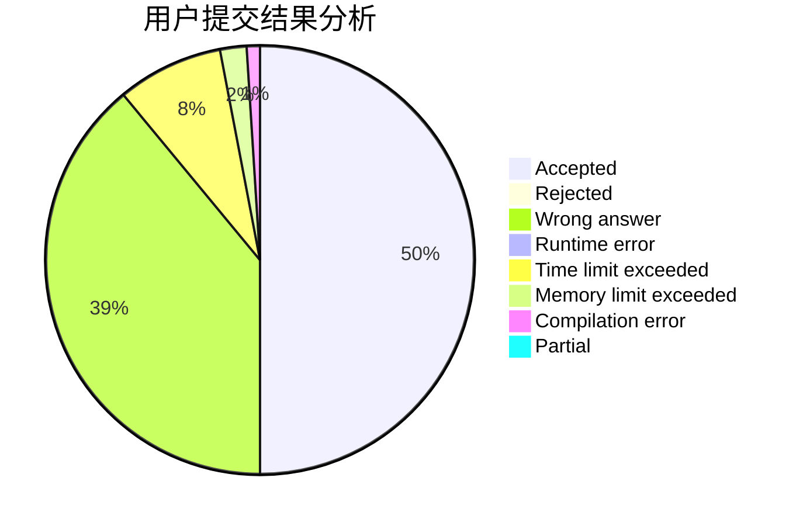
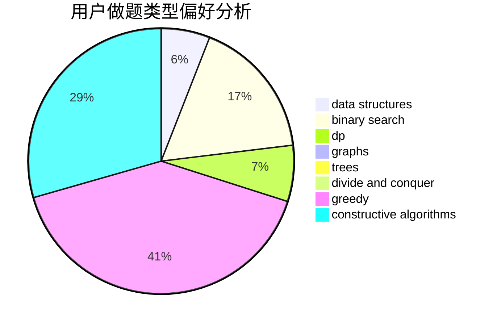
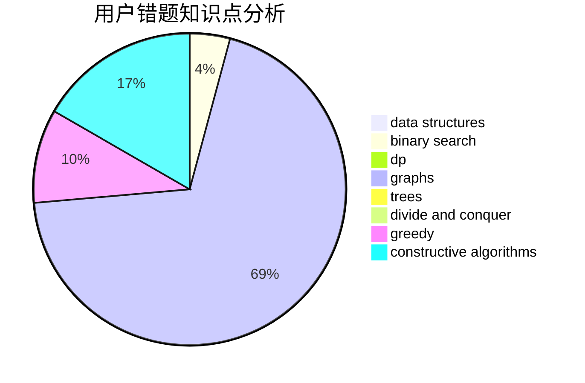

# zhenGG

<!-- tabs:start -->

#### **用户提交结果分析**

#### **用户做题类型偏好分析**

#### **用户错题知识点分析**

<!-- tabs:end -->
# 推荐题目
[582D](https://codeforces.com/contest/582/problem/D)		dp,
                        math,
                        number theory		  
[702A](https://codeforces.com/contest/702/problem/A)		dp,
                        greedy,
                        implementation		  
[725E](https://codeforces.com/contest/725/problem/E)		brute force,
                        greedy		  
[1100F](https://codeforces.com/contest/1100/problem/F)		data structures,
                        divide and conquer,
                        greedy,
                        math		  
[864C](https://codeforces.com/contest/864/problem/C)		greedy,
                        implementation,
                        math		  
[514E](https://codeforces.com/contest/514/problem/E)		dp,
                        matrices		  
[1264B](https://codeforces.com/contest/1264/problem/B)		brute force,
                        constructive algorithms,
                        greedy		  
[665A](https://codeforces.com/contest/665/problem/A)		implementation		  
[464E](https://codeforces.com/contest/464/problem/E)		data structures,
                        graphs,
                        shortest paths		  
[1013A](https://codeforces.com/contest/1013/problem/A)		math		  
