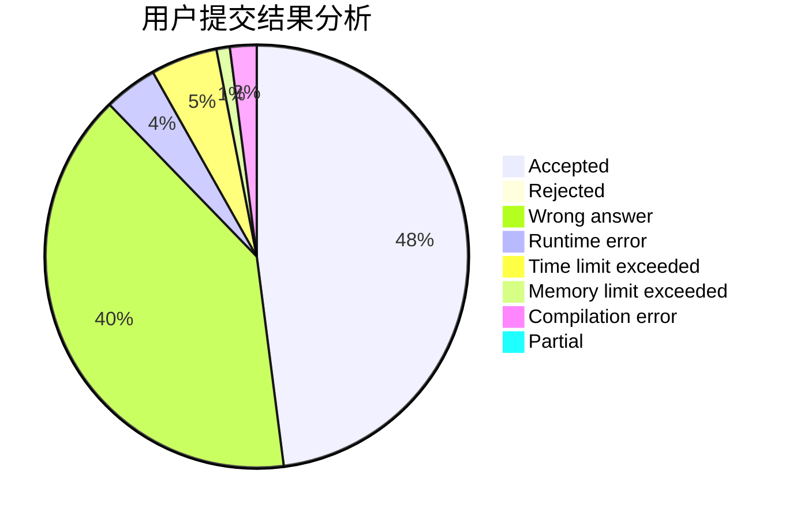
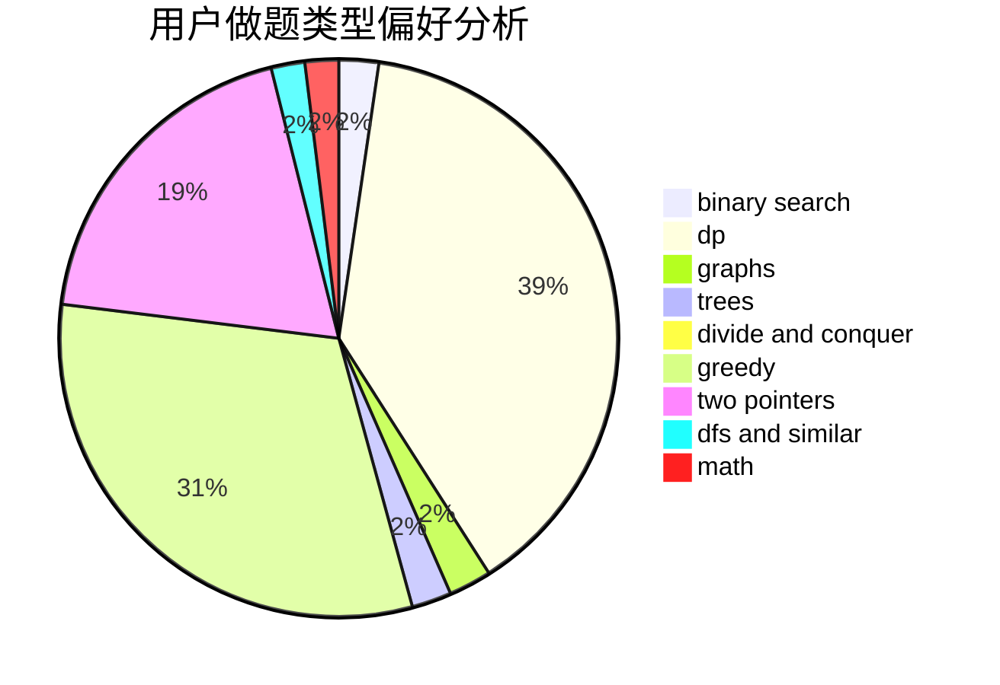

# zhen_de_keng

<!-- tabs:start -->

#### **用户提交结果分析**

#### **用户做题类型偏好分析**

<!-- tabs:end -->
# 推荐题目
[1087E](https://codeforces.com/contest/1087/problem/E)
[1145B](https://codeforces.com/contest/1145/problem/B)
[1314D](https://codeforces.com/contest/1314/problem/D)
[1347D](https://codeforces.com/contest/1347/problem/D)
[1000C](https://codeforces.com/contest/1000/problem/C)
[961C](https://codeforces.com/contest/961/problem/C)
[985E](https://codeforces.com/contest/985/problem/E)
[548C](https://codeforces.com/contest/548/problem/C)
[1346C](https://codeforces.com/contest/1346/problem/C)
[352A](https://codeforces.com/contest/352/problem/A)
