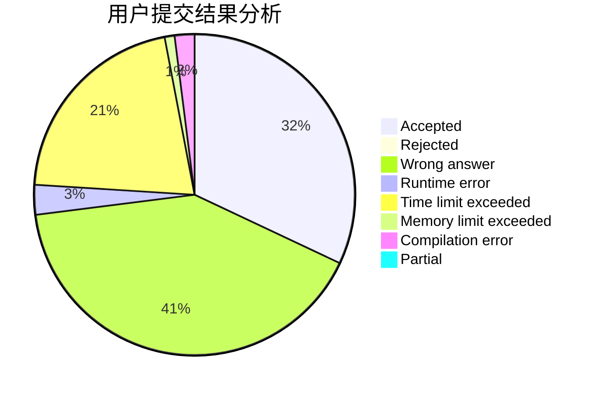
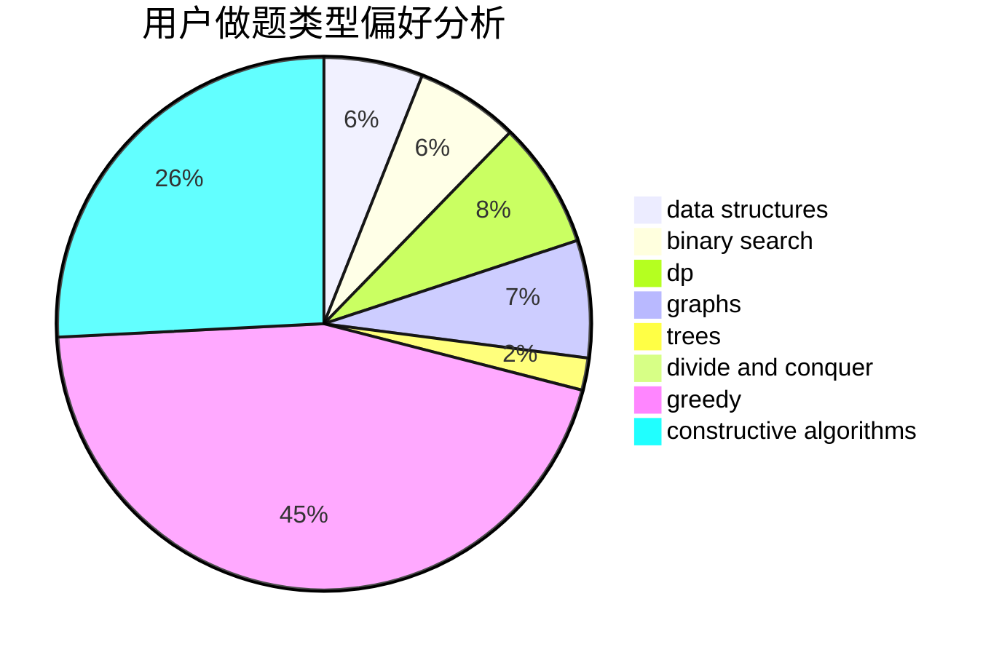
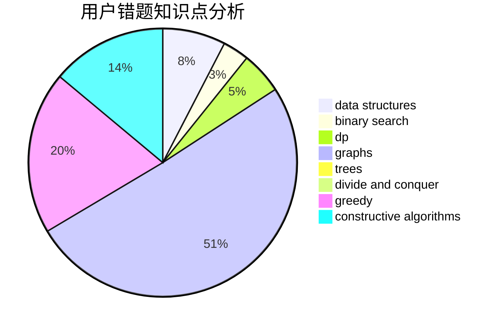

# zhendelan

<!-- tabs:start -->

#### **用户提交结果分析**

#### **用户做题类型偏好分析**

#### **用户错题知识点分析**

<!-- tabs:end -->
# 推荐题目
[1506E](https://codeforces.com/contest/1506/problem/E)		constructive algorithms,
                        implementation		  
[17E](https://codeforces.com/contest/17/problem/E)		strings		  
[1297C](https://codeforces.com/contest/1297/problem/C)		*special problem,
                        greedy		  
[678B](https://codeforces.com/contest/678/problem/B)		implementation		  
[505B](https://codeforces.com/contest/505/problem/B)		dfs and similar,
                        dp,
                        dsu,
                        graphs		  
[859E](https://codeforces.com/contest/859/problem/E)		combinatorics,
                        dfs and similar,
                        dsu,
                        graphs,
                        trees		  
[1154E](https://codeforces.com/contest/1154/problem/E)		data structures,
                        implementation,
                        sortings		  
[780C](https://codeforces.com/contest/780/problem/C)		dfs and similar,
                        graphs,
                        greedy,
                        trees		  
[140E](https://codeforces.com/contest/140/problem/E)		combinatorics,
                        dp		  
[1250A](https://codeforces.com/contest/1250/problem/A)		implementation		  
