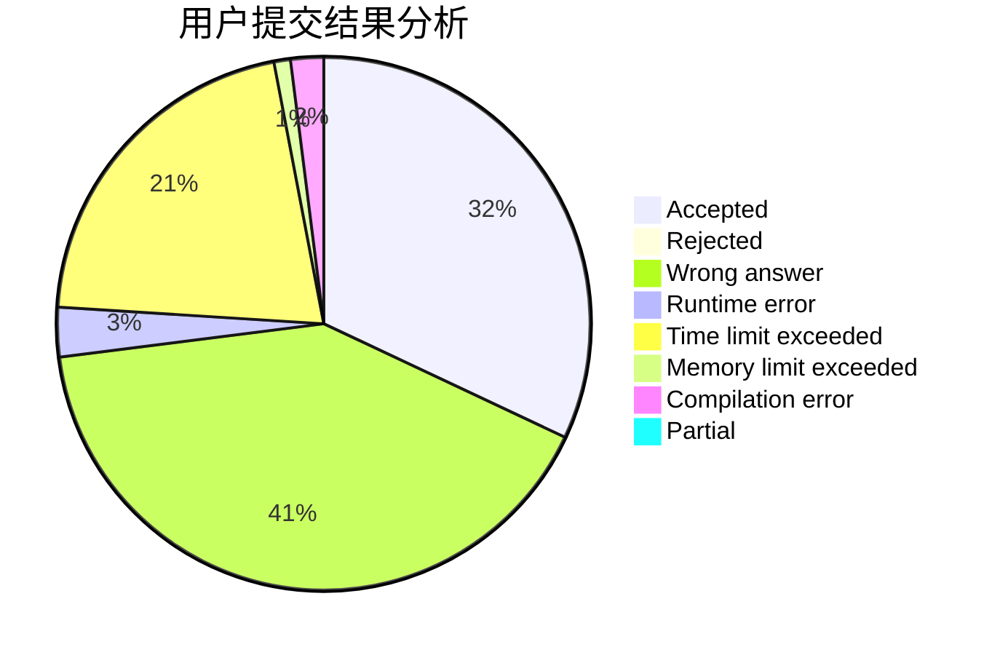
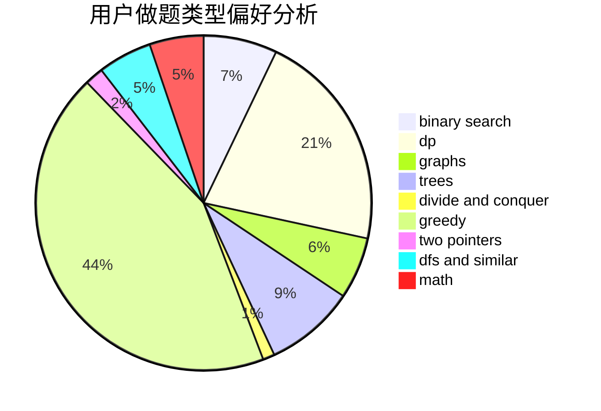

# zhendelan

<!-- tabs:start -->

#### **用户提交结果分析**

#### **用户做题类型偏好分析**

<!-- tabs:end -->
# 推荐题目
[1506E](https://codeforces.com/contest/1506/problem/E)
[17E](https://codeforces.com/contest/17/problem/E)
[1297C](https://codeforces.com/contest/1297/problem/C)
[678B](https://codeforces.com/contest/678/problem/B)
[505B](https://codeforces.com/contest/505/problem/B)
[859E](https://codeforces.com/contest/859/problem/E)
[1154E](https://codeforces.com/contest/1154/problem/E)
[780C](https://codeforces.com/contest/780/problem/C)
[140E](https://codeforces.com/contest/140/problem/E)
[1250A](https://codeforces.com/contest/1250/problem/A)
