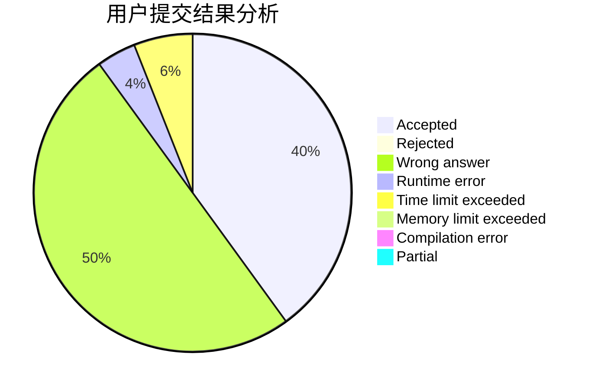
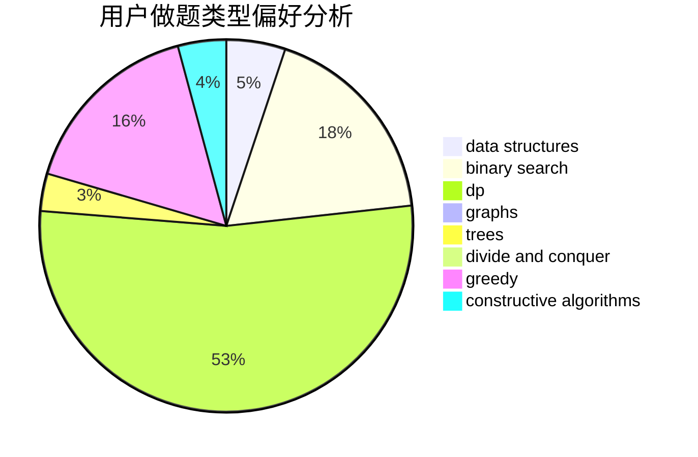
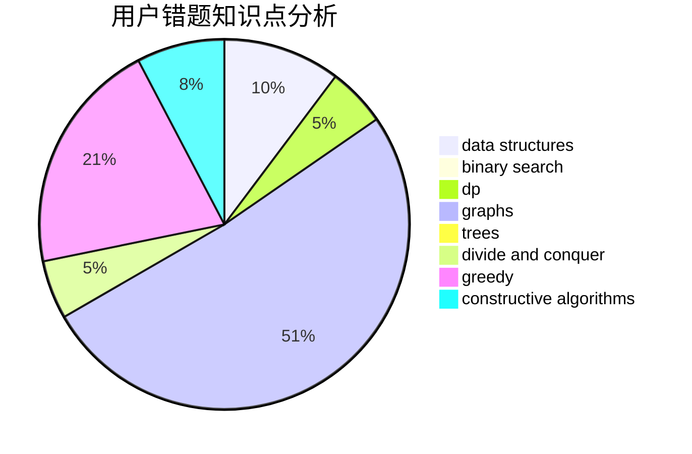

# zhenglier

<!-- tabs:start -->

#### **用户提交结果分析**

#### **用户做题类型偏好分析**

#### **用户错题知识点分析**

<!-- tabs:end -->
# 推荐题目
[325B](https://codeforces.com/contest/325/problem/B)		binary search,
                        math		  
[731A](https://codeforces.com/contest/731/problem/A)		implementation,
                        strings		  
[1138D](https://codeforces.com/contest/1138/problem/D)		dsu,graphs,sortings,trees		  
[316D3](https://codeforces.com/contest/316D/problem/3)		dp,
                        math		  
[430A](https://codeforces.com/contest/430/problem/A)		constructive algorithms,
                        sortings		  
[1046I](https://codeforces.com/contest/1046/problem/I)		geometry		  
[372D](https://codeforces.com/contest/372/problem/D)		binary search,
                        data structures,
                        dfs and similar,
                        trees,
                        two pointers		  
[668A](https://codeforces.com/contest/668/problem/A)		dsu,graphs,sortings,trees		  
[833D](https://codeforces.com/contest/833/problem/D)		data structures,
                        divide and conquer,
                        implementation,
                        trees		  
[80B](https://codeforces.com/contest/80/problem/B)		geometry,
                        math		  
