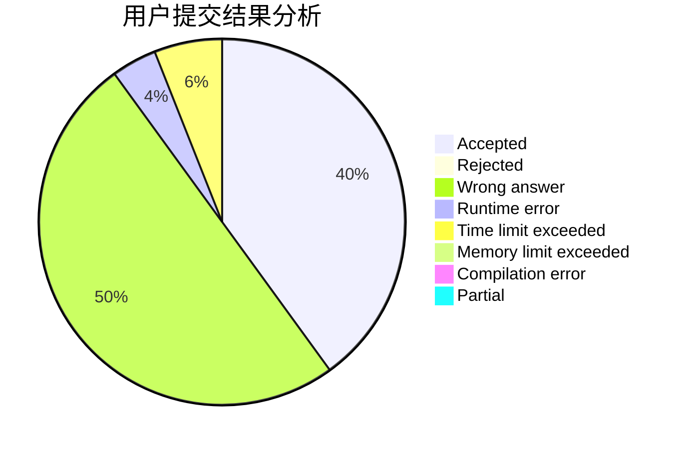
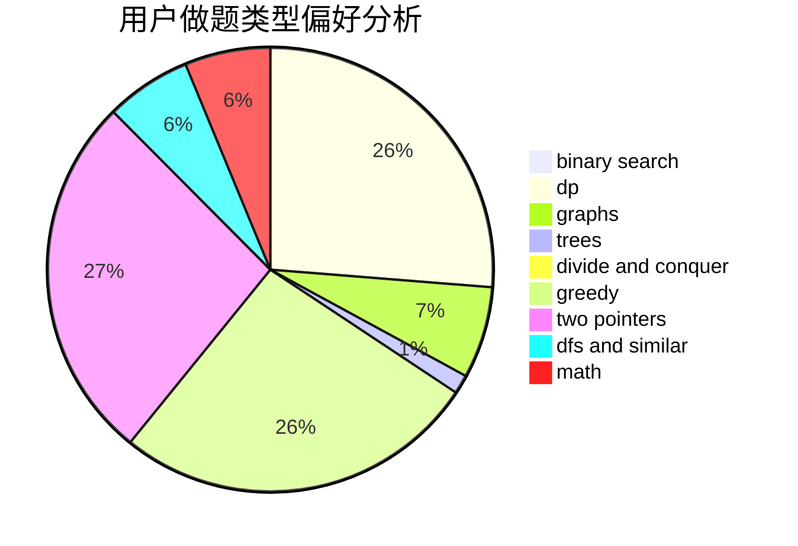

# zhenglier

<!-- tabs:start -->

#### **用户提交结果分析**

#### **用户做题类型偏好分析**

<!-- tabs:end -->
# 推荐题目
[354C](https://codeforces.com/contest/354/problem/C)
[749B](https://codeforces.com/contest/749/problem/B)
[1140B](https://codeforces.com/contest/1140/problem/B)
[342C](https://codeforces.com/contest/342/problem/C)
[452B](https://codeforces.com/contest/452/problem/B)
[1047C](https://codeforces.com/contest/1047/problem/C)
[402D](https://codeforces.com/contest/402/problem/D)
[68A](https://codeforces.com/contest/68/problem/A)
[851D](https://codeforces.com/contest/851/problem/D)
[827F](https://codeforces.com/contest/827/problem/F)
