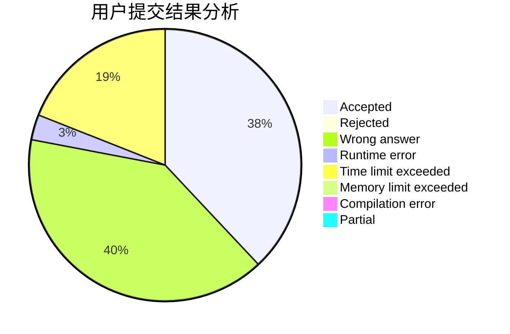
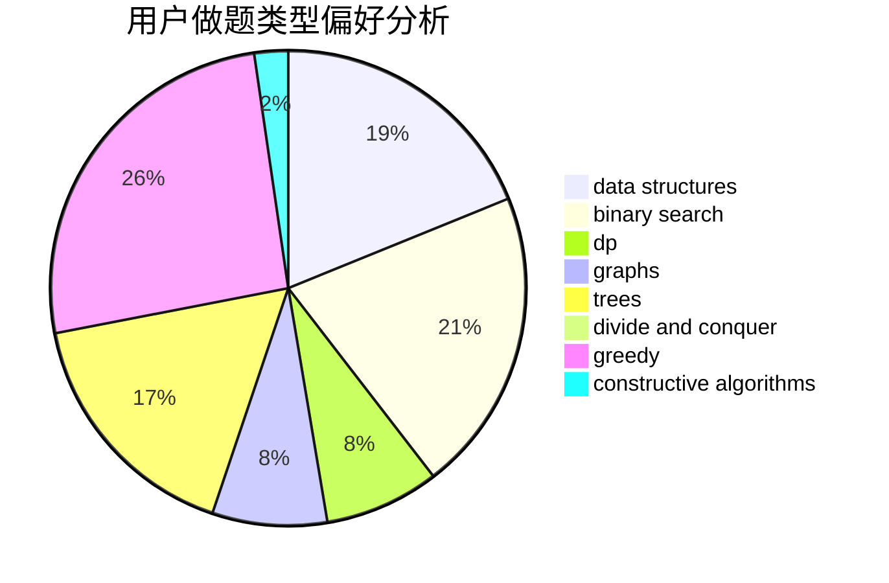
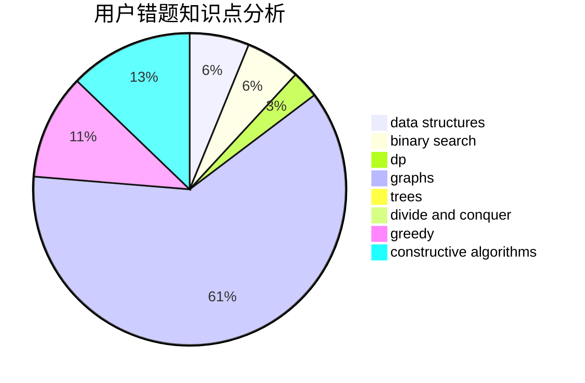

# zheshiyigemingzi

<!-- tabs:start -->

#### **用户提交结果分析**

#### **用户做题类型偏好分析**

#### **用户错题知识点分析**

<!-- tabs:end -->
# 推荐题目
[940D](https://codeforces.com/contest/940/problem/D)		binary search,
                        implementation		  
[842B](https://codeforces.com/contest/842/problem/B)		geometry		  
[1008E](https://codeforces.com/contest/1008/problem/E)		dsu,graphs,sortings,trees		  
[930A](https://codeforces.com/contest/930/problem/A)		dfs and similar,
                        graphs,
                        trees		  
[1153A](https://codeforces.com/contest/1153/problem/A)		brute force,
                        math		  
[1007E](https://codeforces.com/contest/1007/problem/E)		dp		  
[1450H2](https://codeforces.com/contest/1450H/problem/2)		combinatorics,
                        implementation,
                        math		  
[195C](https://codeforces.com/contest/195/problem/C)		expression parsing,
                        implementation		  
[1286C2](https://codeforces.com/contest/1286C/problem/2)		brute force,
                        constructive algorithms,
                        hashing,
                        interactive,
                        math		  
[1469E](https://codeforces.com/contest/1469/problem/E)		bitmasks,
                        brute force,
                        hashing,
                        string suffix structures,
                        strings,
                        two pointers		  
