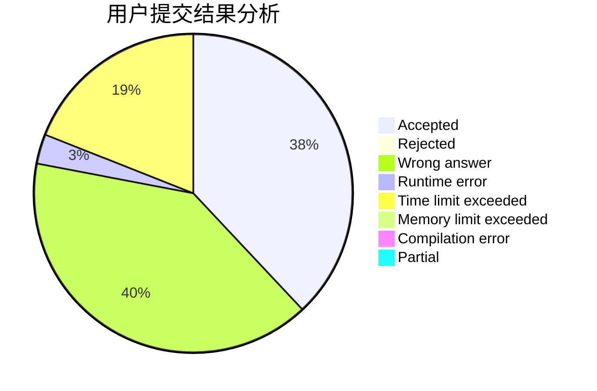
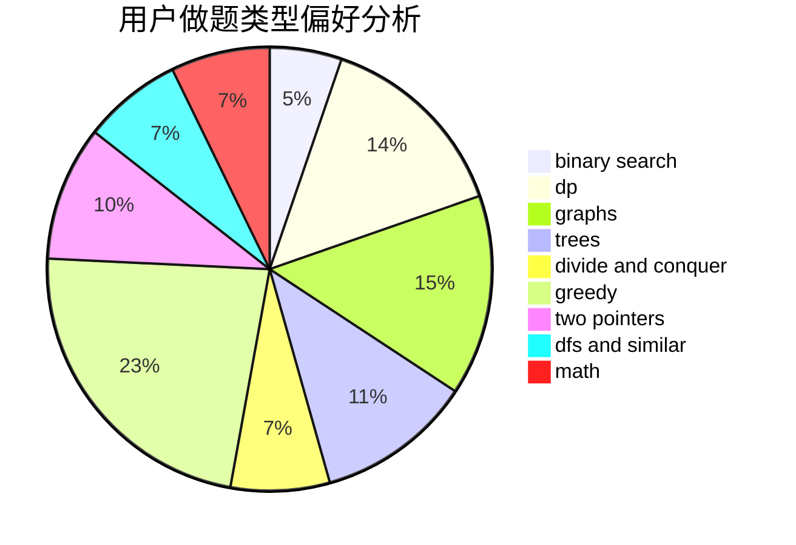

# zheshiyigemingzi

<!-- tabs:start -->

#### **用户提交结果分析**

#### **用户做题类型偏好分析**

<!-- tabs:end -->
# 推荐题目
[962A](https://codeforces.com/contest/962/problem/A)
[861A](https://codeforces.com/contest/861/problem/A)
[1009C](https://codeforces.com/contest/1009/problem/C)
[94C](https://codeforces.com/contest/94/problem/C)
[1155A](https://codeforces.com/contest/1155/problem/A)
[1008C](https://codeforces.com/contest/1008/problem/C)
[1459F](https://codeforces.com/contest/1459/problem/F)
[218C](https://codeforces.com/contest/218/problem/C)
[1293E](https://codeforces.com/contest/1293/problem/E)
[1477F](https://codeforces.com/contest/1477/problem/F)
