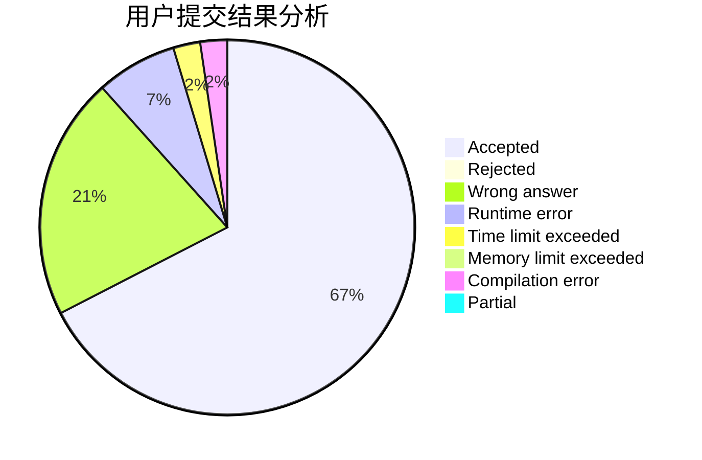
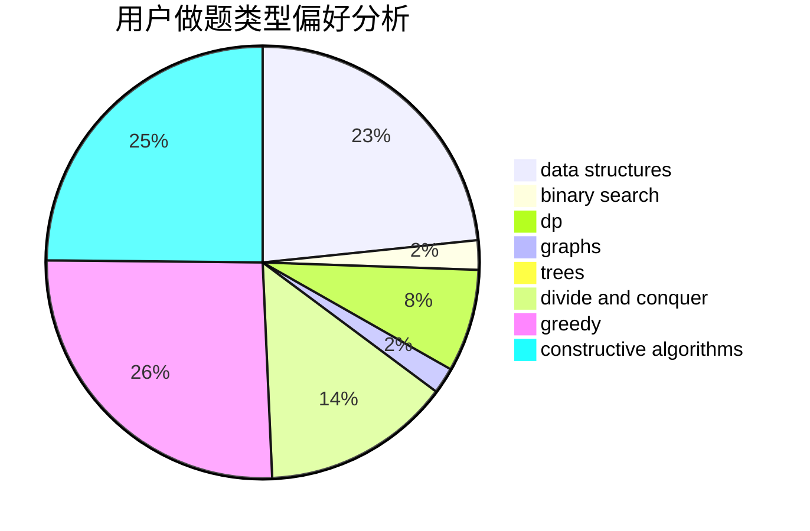
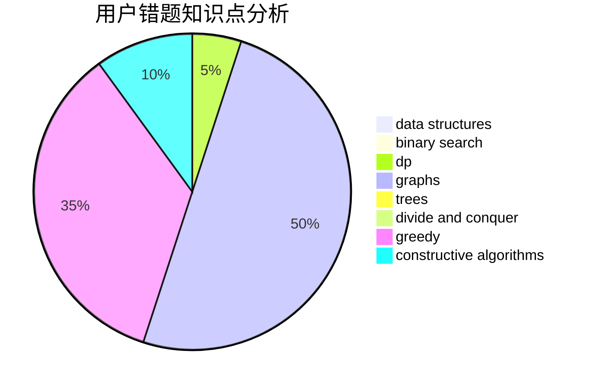

# 17B26LinZhengYu

<!-- tabs:start -->

#### **用户提交结果分析**

#### **用户做题类型偏好分析**

#### **用户错题知识点分析**

<!-- tabs:end -->
# 推荐题目
[11841](https://codeforces.com/contest/1184/problem/1)		dsu,graphs,sortings,trees		  
[1183G](https://codeforces.com/contest/1183/problem/G)		greedy,
                        implementation,
                        sortings		  
[1183H](https://codeforces.com/contest/1183/problem/H)		dp,
                        strings		  
[1087D](https://codeforces.com/contest/1087/problem/D)		dsu,graphs,sortings,trees		  
[1182C](https://codeforces.com/contest/1182/problem/C)		data structures,
                        greedy,
                        strings		  
[1183E](https://codeforces.com/contest/1183/problem/E)		dp,
                        graphs,
                        implementation,
                        shortest paths		  
[1181D](https://codeforces.com/contest/1181/problem/D)		binary search,
                        data structures,
                        implementation,
                        sortings,
                        trees,
                        two pointers		  
[1182F](https://codeforces.com/contest/1182/problem/F)		binary search,
                        data structures,
                        number theory		  
[1180D](https://codeforces.com/contest/1180/problem/D)		dsu,graphs,sortings,trees		  
[1180C](https://codeforces.com/contest/1180/problem/C)		dsu,graphs,sortings,trees		  
